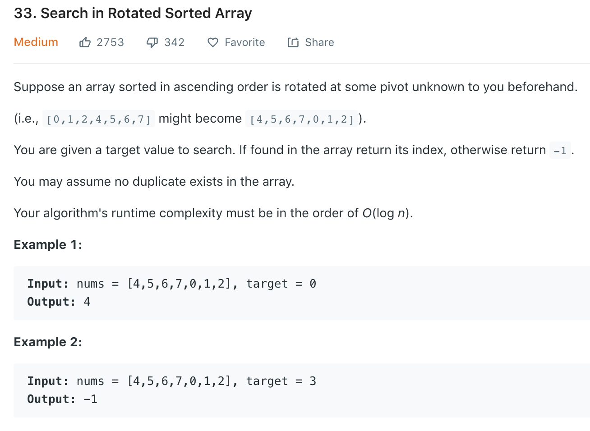

Note __No__ duplicates in the array.
### Solution 1
```python
class Solution(object):
    def search(self, nums, target):
        """
        :type nums: List[int]
        :type target: int
        :rtype: int
        """
        n = len(nums)
        lo, hi = 0, n - 1
        # find the index of the smallest value using binary search
        # loop will terminate since mid < hi, and lo or hi will shrink by at least 1
        # Proof by contradiction that mid < hi: if mid==hi, then lo==hi and loop would have been terminated
        while lo < hi:#note the diff l12, l20
            mid = (lo + hi) // 2
            if nums[mid] > nums[hi]: lo = mid + 1
            else: hi = mid
        # lo == hi is the index of the smallest value and also the place of rotation
        rot = lo
        lo, hi = 0, n - 1
        # The usual binary search and accounting for rotation
        while lo <= hi:
            mid = (lo + hi) // 2
            realmid = (mid + rot) % n
            if nums[realmid] == target: return realmid
            if nums[realmid] < target: lo = mid + 1
            else: hi = mid - 1
        return -1
```

### Solution 2
Refer to [here](https://leetcode.com/problems/search-in-rotated-sorted-array/discuss/14435/Clever-idea-making-it-simple).
```python
class Solution(object):
    def search(self, nums, target):
        lo, hi = 0, len(nums) - 1
        while lo <= hi:
            mid = lo + (hi - lo) // 2
            # if nums[mid] and target are at the same side, just take the value
            if (nums[mid] < nums[0]) is (target < nums[0]):
                val = nums[mid]
            # padding left to -INF
            elif target < nums[0]:   val = -float('inf')
            # padding right to INF
            else:   val = float('inf')

            if val < target:
                lo = mid + 1
            elif val > target:
                hi = mid - 1
            else:
                return mid
        return -1
```
```python
class Solution(object):
    def search(self, nums, target):
        lo, hi = 0, len(nums)
        while lo < hi:
            mid = lo + (hi - lo) // 2
            if (nums[mid] < nums[0]) is (target < nums[0]):
                val = nums[mid]
                if val < target:    lo = mid + 1
                elif val > target:  hi = mid
                else:   return mid

            elif target < nums[0]: lo = mid + 1
            else:   hi = mid
        return -1
```

### Solution 3
Refer to [here](https://leetcode.com/problems/search-in-rotated-sorted-array/discuss/14436/Revised-Binary-Search). <br>
Note at when array is separated at any point, at least half of the array is orderd. For ex, [4 5 6 7 1 2 3], pivot = 7, left is [4 5 6 7], right is [7 1 2 3]. The left part is ordered. We can first find out which part is ordered (by two endpoints), if target is in ordered part, discard the other half, if not, discard this half. 
```python
class Solution(object):
    def search(self, nums, target):
        lo, hi = 0, len(nums) - 1
        while lo <= hi:
            mid = (lo + hi) // 2
            if nums[mid] == target: return mid

            # left part is ordered
            if nums[lo] <= nums[mid]:
                # note nums[mid] != target 
                if nums[lo] <= target < nums[mid]:
                    hi = mid - 1
                else:
                    lo = mid + 1
            # right part is ordered
            else:
                if nums[mid] < target <= nums[hi]:
                    lo = mid + 1
                else:
                    hi = mid - 1
        
        return -1

```