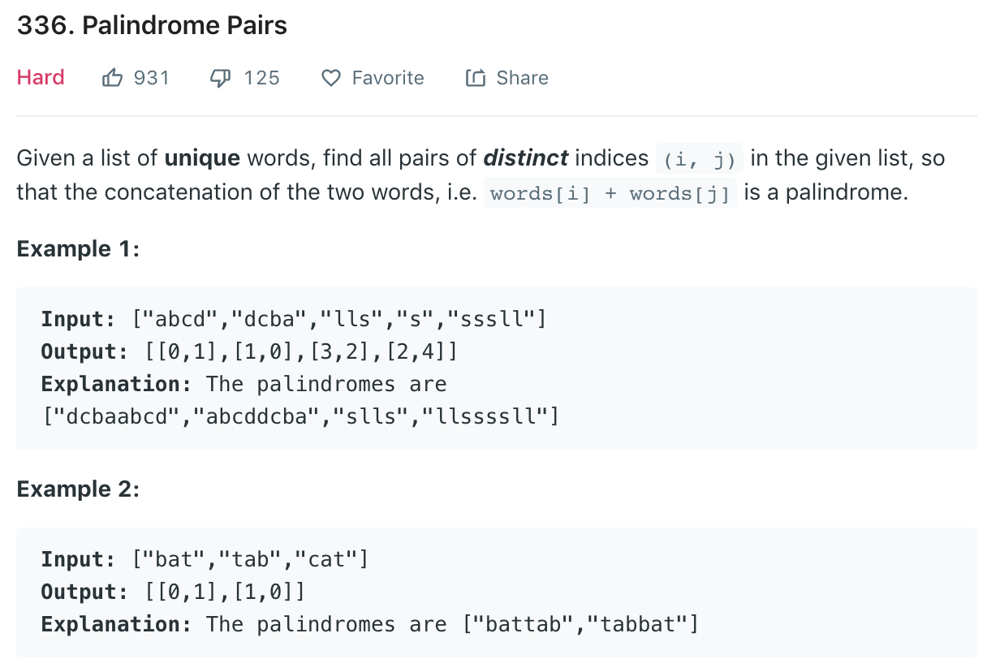

### Solution Brutal Force TLE
Just iterate through all combinations, concatenate string and see if is palindrome
```python
class Solution(object):
    def palindromePairs(self, words):
        """
        :type words: List[str]
        :rtype: List[List[int]]
        """
        res = []
        n = len(words)
        for i in range(n):
            for j in range(n):
                if i != j:
                    if self.isPalindrome(words[i] + words[j]):
                        res.append([i, j])
        
        return res
    
    def isPalindrome(self, word):
        i, j = 0, len(word) - 1
        while i < j:
            if word[i] == word[j]:
                i += 1
                j -= 1
            else:
                return False
        
        return True
```
### Solution 2
Refer to [here](https://fizzbuzzed.com/top-interview-questions-5/).
```python
def palindromePairs(words):
    d, res = dict([(w[::-1], i) for i, w in enumerate(words)]), []
    for i, w in enumerate(words):
        for j in range(len(w)+1):
            prefix, postfix = w[:j], w[j:]
            if prefix in d and i != d[prefix] and postfix == postfix[::-1]:
                res.append([i, d[prefix]])
            if j>0 and postfix in d and i != d[postfix] and prefix == prefix[::-1]:
                res.append([d[postfix], i])
    return res
```
A clearer way
```python
def palindromePairs(words):
    d = {w: i for i, w in enumerate(words)}
    ans = []
    for i, w in enumerate(words):
        # no divide, two cases
        if w[::-1] in d and d[w[::-1]] != i:
            ans.append([i, d[w[::-1]]])
        if w != '' and w[::-1] == w and '' in d:
            ans.append([i, d['']])
            ans.append([d[''], i])

        # divide into two parts, can't be self, another two cases
        for k in range(1, len(w)):
            s1, s2 = w[:k], w[k:]
            if s1 == s1[::-1] and s2[::-1] in d:
                ans.append([d[s2[::-1]], i])
            if s2 == s2[::-1] and s1[::-1] in d:
                ans.append([i, d[s1[::-1]]])
    return ans
```

### Solution 3 Trie
Refer to [here](https://leetcode.com/problems/palindrome-pairs/discuss/176205/Beats-80-Trie-Java-with-Explanations).
```
We want to concatenate string B to string A to make AB palindrome.

How could AB be palindrome? 
If B ends with x, then A must starts with x. If the second character of B is y, then the second last character of A is y...
That is,
  Case 1. A must be prefix of reversed B, and the rest of reversed B should be palindrome. For example,
	(B:oooabc - cbaooo,    A:cba       AB:cba|oooabc)
  Case 2. Or, reversed B must be prefix of A, and the rest of A should be palindrome. For example,
	(B:abc - cba           A:cbaooo,   AB:cbaooo|abc)
    
Each word in words can be B. We put all reversed words in a trie. 
Each word in words can be A. So we search A in trie, 
In this way,
  Case 1. if we found A in trie, and the branch under the end node is a palindrome, we found it!
  Case 2. if we reach a leaf of trie, and the rest of A is palindrome, we found it! 
  
  For Case 1., we modify TrieNode data structure by adding belowPalindromeWordIds - list of word indices such that nodes below can construct a palindrome.
  For Case 2., we create a method isPalindrome(str, start, end) .

Please take care of corner cases of empty string. Both ("", self-palindrome) and (self-palindrome, "") are still palindrome.
```