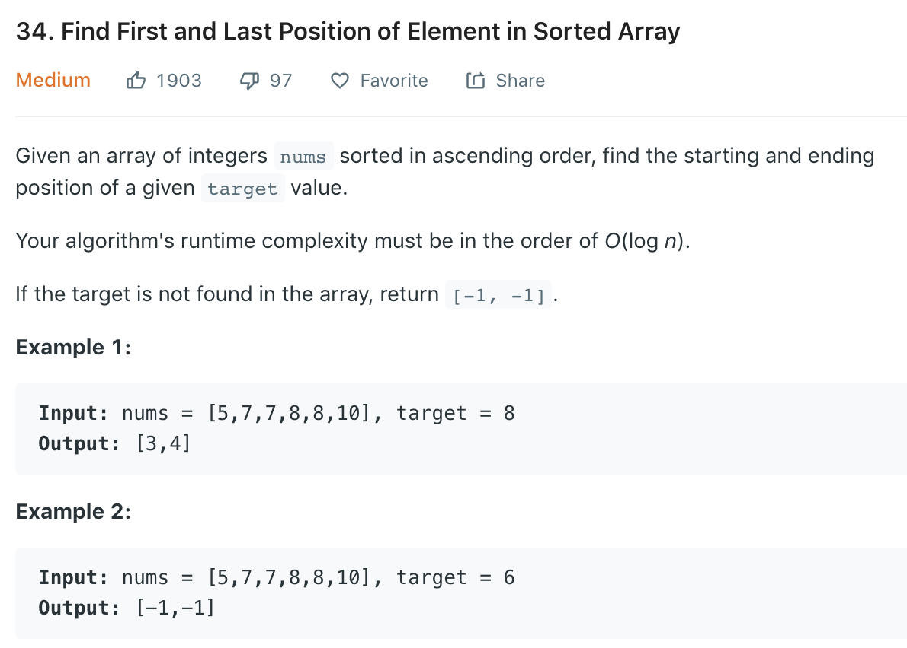

Based on [35](35.md).
### Solution
```python
    def searchRange2(self, nums, target):
        """
        :type nums: List[int]
        :type target: int
        :rtype: List[int]
        """
        lo = self.firstGreaterEqual(nums, target)
        if lo >= len(nums) or nums[lo] != target:#handle empty set
            return [-1, -1]
        else:
            return [lo, self.firstGreaterEqual(nums, target + 1) - 1]

    def firstGreaterEqual(self, nums, target):
        # end = len(nums) not len(nums)-1, very important here. As this will give u the right pos if target > nums[-1]
        start, end = 0, len(nums)
        while start < end:
            mid = start + ((end - start) >> 1)
            if nums[mid] < target:
                start = mid + 1
            else:
                end = mid
        return start
```