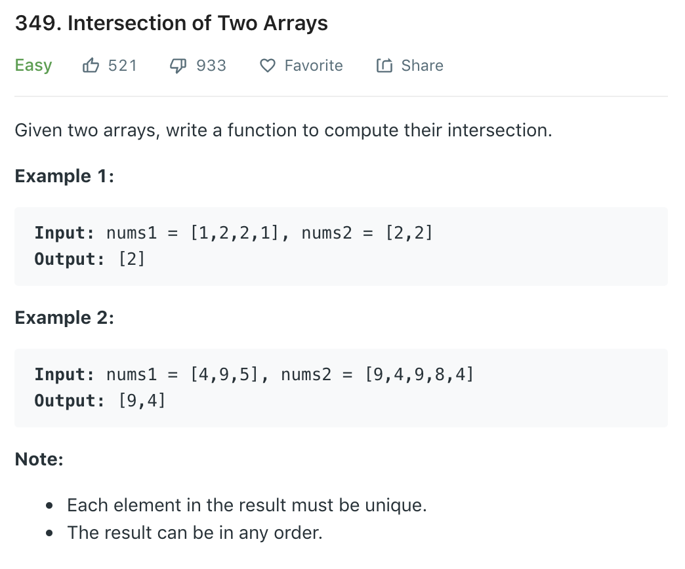

### Solution
```python
class Solution(object):
    def intersection(self, nums1, nums2):
        """
        :type nums1: List[int]
        :type nums2: List[int]
        :rtype: List[int]
        """
        inter = []
        nums1.sort()
        
        for i in range(len(nums1)):
            if i > 0 and nums1[i] == nums1[i - 1]:
                continue
            if nums1[i] in nums2:
                inter.append(nums1[i])
        
        return inter
```