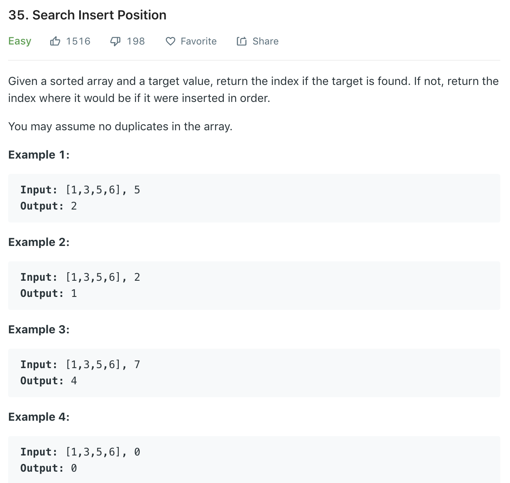

Recall normal binary search (without duplicate target)
```python
lo, hi = 0, len(nums)- 1
while lo <= hi:
    mid = lo + (hi - lo) // 2
    if nums[mid] == target:
        return mid
    elif nums[mid] < target:
        lo = mid + 1
    else:
        hi = mid - 1
return -1

# OR
while lo < hi:
    mid = lo + (hi - lo) // 2
    if nums[mid] < target:
        lo = mid + 1
    else:
        hi = mid
return nums[lo] == target
```
Here we need to handle duplicates, so cannot just stop when nums[mid] == target. One way is to first do a normal binary search, find one position of target, then move left until the number is no longer target, that's the left end we want. Another way is as below.
### Solution
```python
class Solution(object):
    def searchInsert(self, nums, target):
        """
        :type nums: List[int]
        :type target: int
        :rtype: int
        """
        lo, hi = 0, len(nums)
        while lo < hi:
            mid  = (lo + hi) // 2
            if nums[mid] < target:
                lo = mid + 1
            else:
                hi = mid
        return lo
```