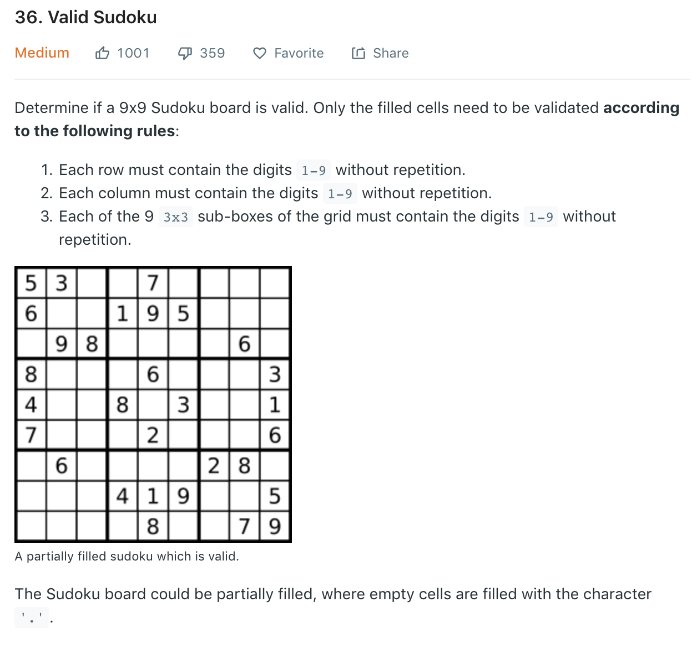

### Solution 1
most naive, evaluate each criteria for row, col and cube
```python
    def isValidSudoku2(self, board):
        # checking row
        for i in range(9):
            if not self.isValidRow(board[i]):
                return False
        #     checking col
        for j in range(9):
            if not self.isValidCol(j, board):
                return False
        # checking cube
        for i in range(3):
            for j in range(3):
                if not self.isValidCube(i*3, j*3, board):
                    return False
        return True

    def isValidRow(self, line):
        nums = set()
        for num in line:
            if num != '.':
                if num >= '1' and num <= '9' and num not in nums:
                    nums.add(num)
                else:
                    return False
        return True

    def isValidCol(self, j, board):
        nums = set()
        for i in range(9):
            num = board[i][j]
            if num != '.':
                if num >= '1' and num <= '9' and num not in nums:
                    nums.add(num)
                else:
                    return False
        return True

    def isValidCube(self, i, j, board):
        # checking if cube upper left point at i.j is valid
        nums = set()
        for r in range(3):
            for c in range(3):
                num = board[i + r][j + c]
                if num != '.':
                    if num >= '1' and num <= '9' and num not in nums:
                        nums.add(num)
                    else:
                        return False
        return True
```
### Solution 2 HashSet
Refer to [here](https://leetcode.wang/leetCode-36-Valid-Sudoku.html). Only iterate once instead of three times.
The idea is to use 1 hashset instead of 27 (9 rows + 9 cols + 9 cubes)
```
(5)0 represents number 5 in row 0 
2(3) represents number 3 in col 2 
0(2)1 number 2 in cube (upper left point 0*3, 1*3)
```
```python
def isValidSudoku3(board):
    seen = set()
    for i in range(9):
        for j in range(9):
            if board[i][j] != '.':
                b = "(" + board[i][j] + ")"
                if (b + str(i) in seen) or (str(j) + b in seen) or (str(i//3) + b + str(j//3) in seen):
                    return False
                else:
                    seen.add(b + str(i))
                    seen.add(str(j) + b)
                    seen.add(str(i//3) + b + str(j//3))
    return True
```
### Solution 3
```python
def isValidSudoku(board):
    for i in range(9):
        rows = set()
        cols = set()
        cube = set()
        for j in range(9):
            if board[i][j] != '.' and board[i][j] in rows:
                return False
            elif board[i][j] != '.':
                rows.add(board[i][j])
            if board[j][i] != '.' and board[j][i] in cols:
                return False
            elif board[j][i] != '.':
                cols.add(board[j][i])
            rowIndex = 3 * (i // 3)
            colIndex = 3 * (i % 3)
            if board[rowIndex + j // 3][colIndex + j % 3] != '.' and\
                (board[rowIndex + j // 3][colIndex + j % 3] in cube):
                return False
            elif board[rowIndex + j // 3][colIndex + j % 3] != '.':
                cube.add(board[rowIndex + j // 3][colIndex + j % 3])
    return True
```
