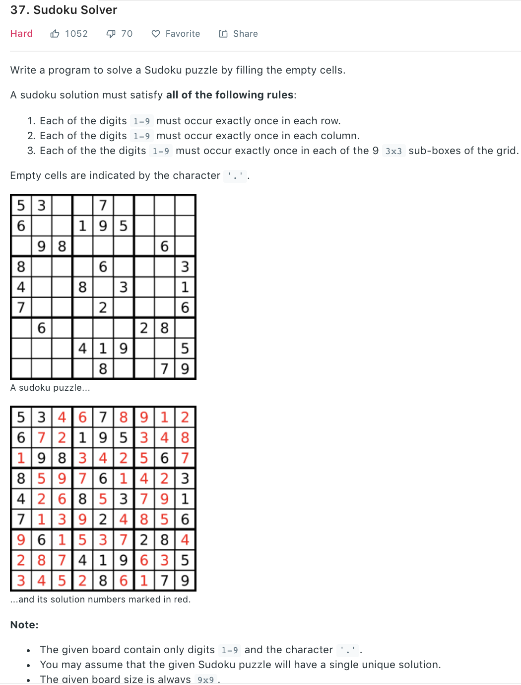

### Solution backtracing
Based on [36](36.md)
```python
def solveSudoku(board):
    """
    :type board: List[List[str]]
    :rtype: None Do not return anything, modify board in-place instead.
    """
# backtracing
    if not board: return
    solver(board)

# solves board, return boolean
def solver(board):
    for i in range(len(board)):
        for j in range(len(board[0])):
            if board[i][j] != '.':
                continue
            for o in range(ord('1'), ord('9') + 1):
                count = chr(o)
                # can we change the order here? first assign then check validity
                if isValid(i, j, board, count):
                    board[i][j] = count
                    if solver(board):
                        return True
                    else:
                        board[i][j] = '.'
            return False
    return True

# to verify if it is allowed to put count in board[row][col] (haven't put)
def isValid(row, col, board, count):
    for j in range(len(board[0])):
        if board[row][j] == count:
            return False
    for i in range(len(board)):
        if board[i][col] == count:
            return False
    rowIndex = row // 3
    colIndex = col // 3
    for i in range(3):
        for j in range(3):
            if board[rowIndex*3 + i][colIndex*3 + j] == count:
                return False

    return True
```
