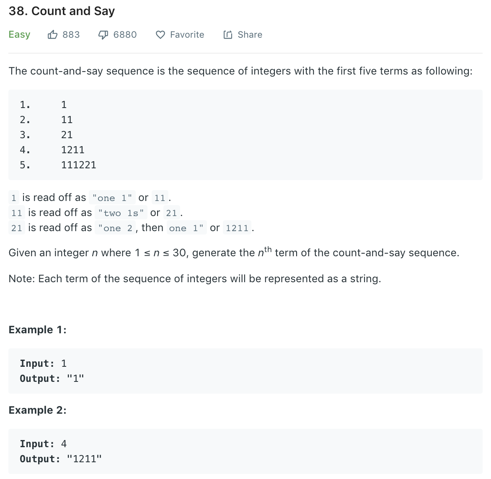

### Solution
```python
def countAndSay(n):
    """
    :type n: int
    :rtype: str
    """
    def helper(arr):
        buff = []
        count = 1
        for i in range(len(arr) - 1):
            if arr[i] != arr[i + 1]:
                buff.append(str(count))
                buff.append(arr[i])
                count = 1
            else:
                count += 1
        buff.append(str(count))
        buff.append(arr[-1])
        return buff

    res = ['1']
    for i in range(n - 1):
        res = helper(res)

    return ''.join(res)
```