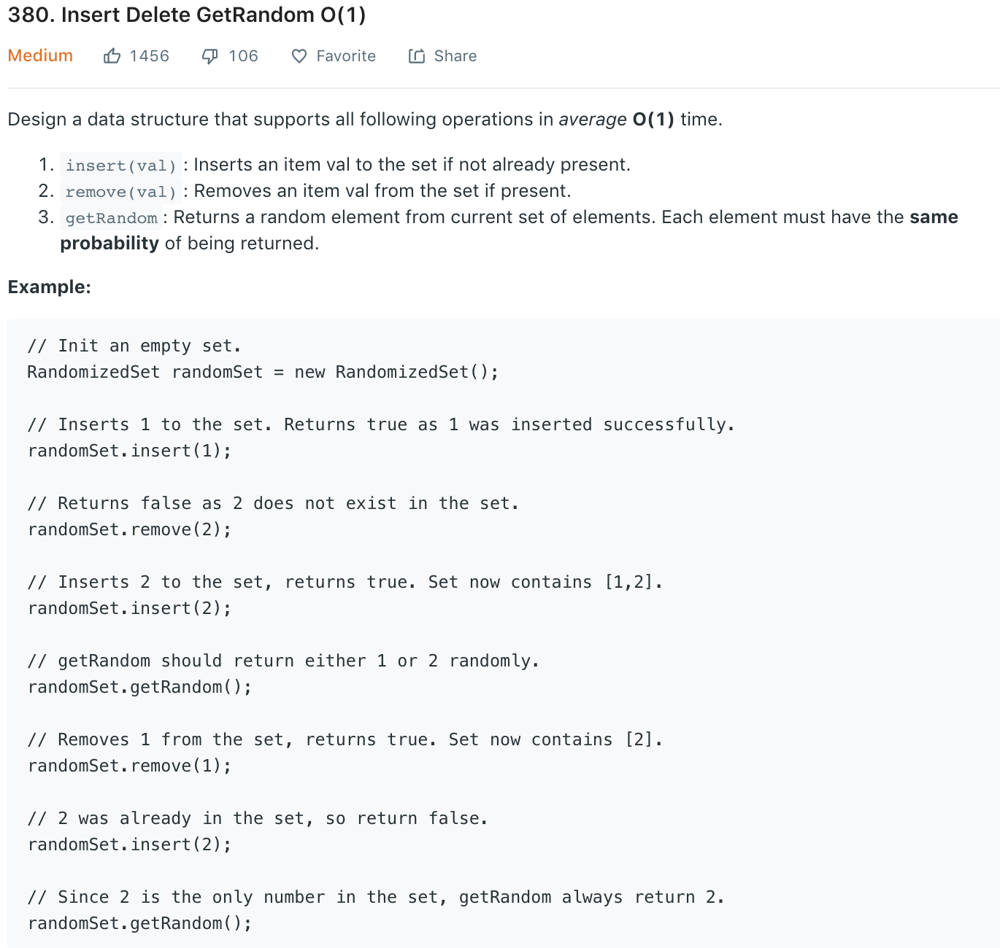

### Solution
ArrayList + HashMap (key: number, value: number position in ArrayList)
```python
import random

class RandomizedSet(object):

    def __init__(self):
        """
        Initialize your data structure here.
        """
        self.arr = []
        self.map = {}

    def insert(self, val):
        """
        Inserts a value to the set. Returns true if the set did not already contain the specified element.
        :type val: int
        :rtype: bool
        """
        if val in self.map:
            return False
        self.map[val] = len(self.arr)
        self.arr.append(val)
        return True

    def remove(self, val):
        """
        Removes a value from the set. Returns true if the set contained the specified element.
        :type val: int
        :rtype: bool
        """
        if val not in self.map:
            return False
        # `swap` with last element
        idx = self.map[val]
        last = self.arr[-1]
        self.arr[idx] = self.arr[-1]
        self.map[last] = idx
        
        self.arr.pop()
        self.map.pop(val)
        return True
        

    def getRandom(self):
        """
        Get a random element from the set.
        :rtype: int
        """
        return self.arr[random.randint(0, len(self.arr) - 1)]


# Your RandomizedSet object will be instantiated and called as such:
# obj = RandomizedSet()
# param_1 = obj.insert(val)
# param_2 = obj.remove(val)
# param_3 = obj.getRandom()
```