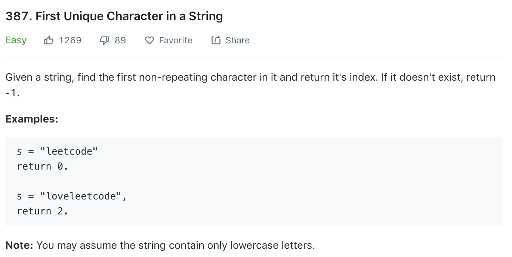

### Solution
```python
class Solution(object):
    def firstUniqChar(self, s):
        """
        :type s: str
        :rtype: int
        """
        counter = dict()
        for c in s:
            counter[c] = counter.get(c, 0) + 1
        
        for i in range(len(s)):
            if counter[s[i]] == 1:
                return i
        
        return -1
```
+ Space complexity: O(n)
+ Time complexity: O(n)
But this method is inefficient at the second iteration if s is long.
### Solution 2
```python
def firstUniqChar(s):
    # in orders, -1 represents haven't met this char,
    # -2 represents met more than once, otherwise represent position of char in s
    orders = [-1] * 26
    for i in range(len(s)):
        pos = ord(s[i]) - 97
        if orders[pos] == -1:
            orders[pos] = i
        elif orders[pos] != -2:
            orders[pos] = -2
    
    res = float('inf')
    for p in orders:
        if p >= 0 and p < res:
            res = p

    if res != float('inf'):
        return res
    else:
        return -1
```
+ Space complexity: O(1)