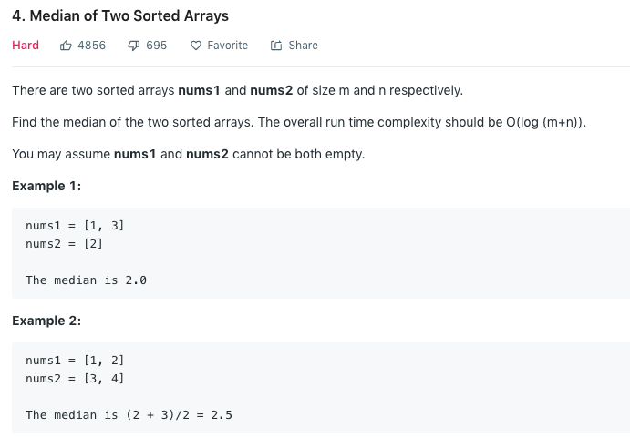

### Solution
It's trivial to do O(m+n) by first merge the two lists then directly return middle element.
To achieve O(log(m+n)), refer to [here](https://leetcode.com/problems/median-of-two-sorted-arrays/solution/) or [here](https://leetcode.com/problems/median-of-two-sorted-arrays/discuss/2481/Share-my-O(log(min(mn)))-solution-with-explanation).
```python
class Solution(object):
    def findMedianSortedArrays(self, A, B):
        """
        :type nums1: List[int]
        :type nums2: List[int]
        :rtype: float
        """
        m, n = len(A), len(B)
        if m > n:
            A, B, m, n = B, A, n, m
        if n == 0:
            raise ValueError

        imin, imax, half_len = 0, m, (m + n + 1) // 2
        while imin <= imax:
            i = (imin + imax) // 2
            j = half_len - i
            if i < m and B[j - 1] > A[i]:
                # i is too small, must increase it
                imin = i + 1
            elif i > 0 and A[i - 1] > B[j]:
                # i is too big, must decrease it
                imax = i - 1
            else:
                # i is perfect

                if i == 0: #left part of A is empty
                    max_of_left = B[j - 1]
                elif j == 0: #left part of B is empty
                    max_of_left = A[i - 1]
                else:
                    max_of_left = max(A[i - 1], B[j - 1])

                if (m + n) % 2 == 1:#odd number in total, return the one in the very middle
                    return max_of_left

                if i == m:
                    min_of_right = B[j]
                elif j == n:
                    min_of_right = A[i]
                else:
                    min_of_right = min(A[i], B[j])
                #even number, return average of middle two
                return (max_of_left + min_of_right) / 2.0
```
+ Time complexity:O(log(min(m, n)))
+ Space complexity: O(1)