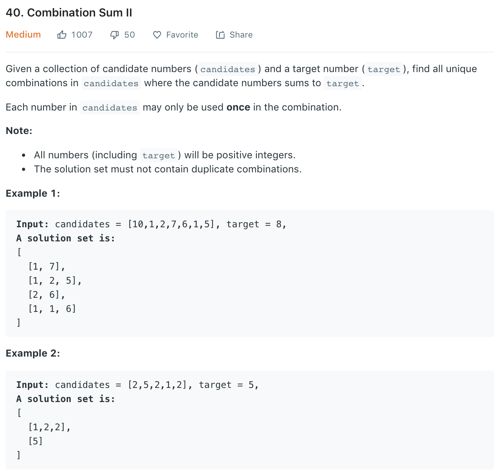

### Solution
```python
class Solution(object):
    def combinationSum2(self, candidates, target):
        """
        :type candidates: List[int]
        :type target: int
        :rtype: List[List[int]]
        """
        candidates.sort()

        res = []
        def dfs(start, path, target):
            if target == 0:
                res.append(path)
                return
            for i in range(start, len(candidates)):
                # prune
                if target < candidates[i]:
                    break
                # remove duplicate results
                if i > start and candidates[i] == candidates[i - 1]:
                    continue
                    # only use an element once
                dfs(i + 1, path + [candidates[i]], target - candidates[i])

        dfs(0, [], target)
        return res
```