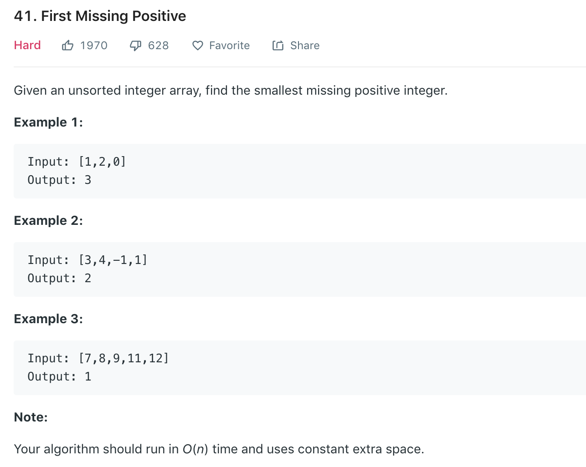

### Solution 1 Hash
1. for any array whose length is l, the first missing positive must be in range [1,...,l+1],
so we only have to care about those elements in this range and remove the rest.
2. we can use the array index as the hash to restore the frequency of each number within the range [1,...,l+1]
```python
class Solution(object):
    def firstMissingPositive(self, nums):
        """
        :type nums: List[int]
        :rtype: int
        """
        nums.append(0)
        n = len(nums)
        #delete useless elements
        for i in range(n):
            if nums[i] < 0 or nums[i] >= n:
                nums[i] = 0
        
        # use index as the hash to record the frequency of each number
        # nums[nums[i]%n]+=n
        for i in range(n):
            nums[nums[i] % n] += n
        
        for i in range(1, n):
            if nums[i] // n == 0:
                return i
        
        return n
```
+ Time complexity: O(n)
+ Space complexity: O(1)
### Solution 2
```python
def firstMissingPos(nums):
    # Put each number in its right place.
    # For example:
    # When we find 5, then swap it with A[4].
    # At last, the first place where its number is not right, return the place + 1.
    n = len(nums)
    for i in range(n):
        curr = nums[i]
        while 0 < curr <= n and nums[curr - 1] != curr:
            next = nums[curr - 1]
            nums[curr - 1] = curr
            curr = next

    for i in range(n):
        if nums[i] != i + 1: return i + 1

    return n + 1
```
### Naive Solution, deleting from list
```python
def firstMissingPositive(nums):
    if not nums: return 1
    lst = list(range(1, len(nums) + 2))
    # remove appeared num from lst
    for num in nums:
        if num in lst:
            lst.remove(num)
    return lst[0]
```
+ Time complexity: O(n2) due to check and remove
+ Space complexity: O(n)