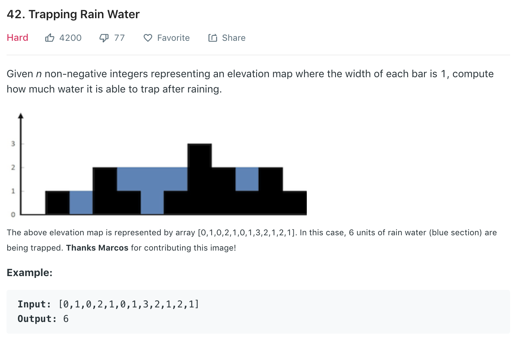

### Solution
Refer to [here](https://leetcode.com/problems/trapping-rain-water/discuss/17391/Share-my-short-solution).
instead of calculating area by height*width, we can think it in a cumulative way.
In other words, sum water amount of each bin(width=1).
Search from left to right and maintain a max height of left and right separately,
which is like a one-side wall of partial container. Fix the higher one and flow water from the lower part.
For example, if current height of left is lower, we fill water in the left bin.
Until left meets right, we filled the whole container.
```python
class Solution(object):
    def trap(self, height):
        """
        :type height: List[int]
        :rtype: int
        """
        left, right = 0, len(height) - 1
        maxLeftHeight, maxRightHeight = 0, 0
        ans = 0
        while left <= right:
            maxLeftHeight = max(maxLeftHeight, height[left])
            maxRightHeight = max(maxRightHeight, height[right])
            
            if maxLeftHeight < maxRightHeight:
                ans += maxLeftHeight - height[left]
                left += 1
            
            else:
                ans += maxRightHeight - height[right]
                right -= 1
        
        return ans
```
Similarly.
```python
def trap(height):
    n = len(height)
    left, right = 0, n - 1
    res = 0
    maxLeft, maxRight = 0, 0

    while left <= right:
        if height[left] <= height[right]:
            if height[left] >= maxLeft: maxLeft = height[left]
            else: res += maxLeft - height[left]
            left += 1
        else:
            if height[right] >= maxRight: maxRight = height[right]
            else: res += maxRight - height[right]
            right -= 1

    return res
```