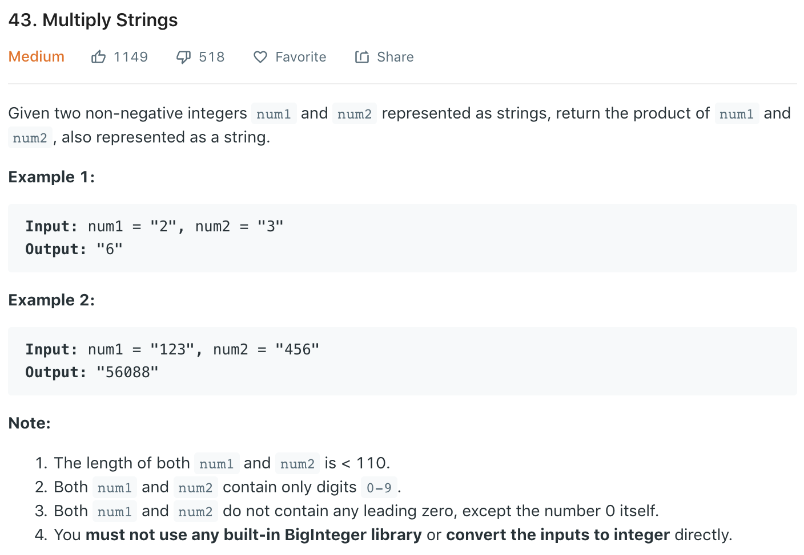

### Solution
Refer to [here](). As shown in

`num1[i] * num2[j]` will be placed at indices `[i + j`, `i + j + 1]` 
```python
class Solution(object):
    def multiply(self, num1, num2):
        """
        :type num1: str
        :type num2: str
        :rtype: str
        """
        if num1 == '0' or num2 == '0':
            return "0"
        
        l1, l2 = len(num1), len(num2)
        digits = [0] * (l1 + l2)

        # calculate from the rear
        for i in reversed(range(l1)):
            for j in reversed(range(l2)):
                mul = (ord(num1[i]) - 48) * (ord(num2[j]) - 48)
                p1 = i + j
                p2 = i + j + 1
                mul += digits[p2]
                # as we haven't settle down p1, it's +=
                digits[p1] += mul // 10
                digits[p2] = mul % 10
                
        res = ''
        for digit in digits:
            if digit or res:
                res += str(digit)
        return res

```
Or simply convert string to int, calculate multiplication, then convert back to string.
```python
class Solution(object):
    def multiply(self, num1, num2):
        n1, n2 = 0, 0
        for i in range(len(num1)):
            n1 = n1*10 + ord(num1[i])-48
        for i in range(len(num2)):
            n2 = n2*10 + ord(num2[i])-48
        return str(n1*n2)
```