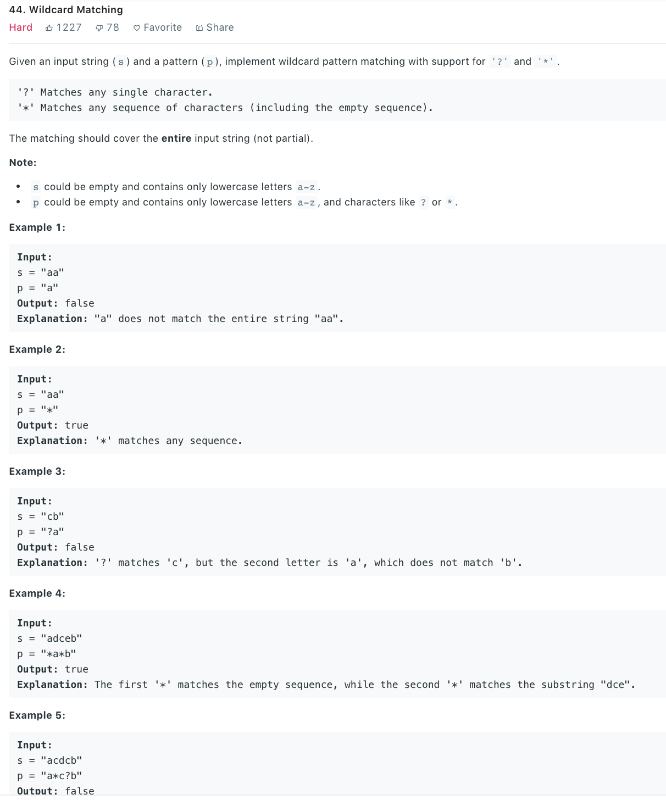

### Solution 1 DP
```python
class Solution(object):
    def isMatch(self, str, pattern):
        """
        :type str: str
        :type pattern: str
        :rtype: bool
        """
        s, p = len(str), len(pattern)
        dp = [[False] * (p + 1) for _ in range(s + 1)]

        dp[0][0] = True
        for j in range(1, p + 1):
            if pattern[j - 1] == '*':
                dp[0][j] = True
            else: break
        
        for i in range(1, s + 1):
            for j in range(1, p + 1):
                if (pattern[j - 1] == '?') or (pattern[j - 1] == str[i - 1]):
                    dp[i][j] = dp[i - 1][j - 1]
                elif pattern[j - 1] == '*':
                    dp[i][j] = dp[i - 1][j] or dp[i][j - 1]
        
        return dp[s][p]
```
Space optimization
```python
def isMatch(str, pattern):
    s, p = len(str), len(pattern)
    dp = [False] * (p + 1)

    dp[0] = True
    for j in range(1, p + 1):
        if pattern[j - 1] == '*':
            dp[j] = True
        else: break

    for i in range(1, s + 1):
        prev = dp[0]
        dp[0] = False
        for j in range(1, p + 1):
            tmp = dp[j]
            if (pattern[j - 1] == '?') or (pattern[j - 1] == str[i - 1]):
                dp[j] = prev
            elif pattern[j - 1] == '*':
                dp[j] = dp[j] or dp[j - 1]
            else:
                dp[j] = False
            prev = tmp

    return dp[p]
```
### Solution 2 Iteration
```python
class Solution(object):
    def isMatch(self, str, pattern):
        # s is pointer to str, p is pointer to pattern
        #     Goal: s, p both to the end
        # match is current matched position in s, starIdx is pos of * in p
        s, p, matchedS, starInP = 0, 0, 0, -1

        #         iterate over whole string
        while s < len(str):
            # if current char matches
            if p < len(pattern) and (str[s] == pattern[p] or pattern[p] == '?'):
                s += 1
                p += 1
            # if meets * and it matches ' ', recordes position of *
            # in startIdx, record current position in string and j++
            elif p < len(pattern) and pattern[p] == '*':
                starInP = p
                matchedS = s
                p += 1
            # cur char does not match and no '*', backtracing
            # here we use '*' to match one character
            elif starInP != -1:
                p = starInP + 1
                matchedS += 1#all before match in s in matched (exclusive)
                s = matchedS
            # cur char does not match and no recorded '*', return False
            else:
                return False

        #         deal with extra '*' at the end of s
        while (p < len(pattern) and pattern[p] == '*'):
            p += 1

        return p == len(pattern)
```