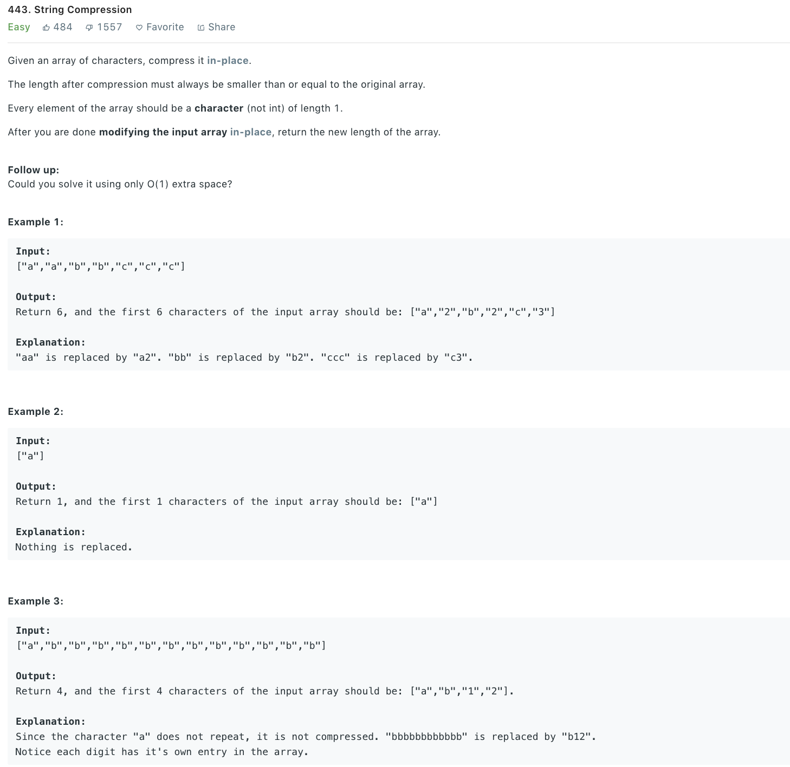

### Solution
```python
class Solution(object):
    def compress(self, chars):
        """
        :type chars: List[str]
        :rtype: int
        """
        i = 0
        count = 1
        j = 1

        while j < len(chars):
            if chars[j] == chars[i]:
                count += 1
            else:
                if count == 1:
                    i += 1
                    chars[i] = chars[j]
                else:
                    # chars[i] = str(count)
                    tmp = str(count)
                    for c in tmp:
                        i += 1
                        chars[i] = c

                    count = 1
                    i += 1
                    chars[i] = chars[j]
            j += 1

        if count > 1:
            # chars[i] = str(count)
            tmp = str(count)
            for c in tmp:
                i += 1
                chars[i] = c

        return i + 1
```