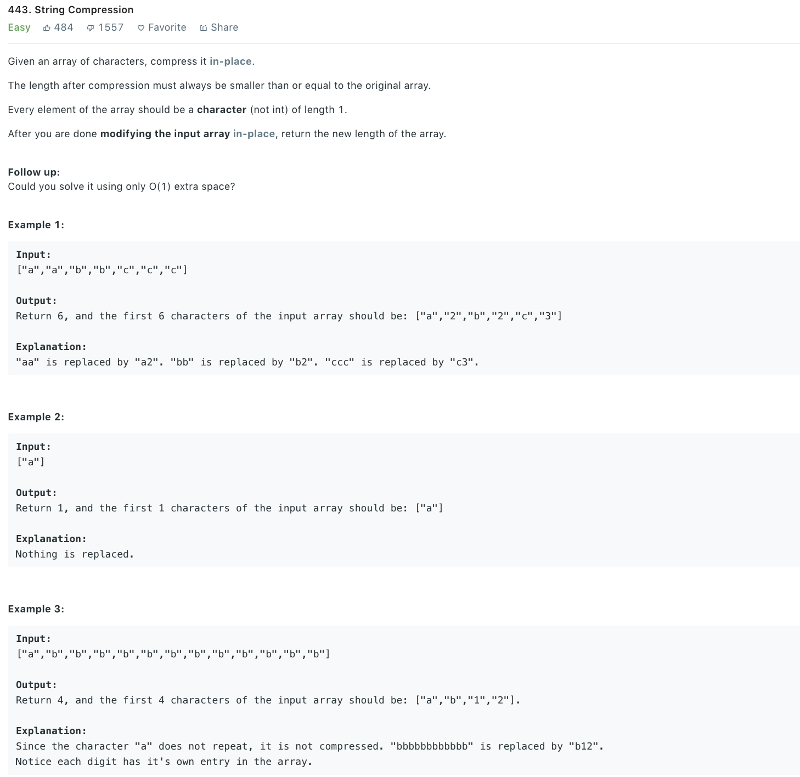

# String Compression

Given an array of characters chars, compress it using the following algorithm:

Begin with an empty string s. For each group of consecutive repeating characters in chars:

If the group's length is 1, append the character to s.
Otherwise, append the character followed by the group's length.
The compressed string s should not be returned separately, but instead, be stored in the input character array chars. Note that group lengths that are 10 or longer will be split into multiple characters in chars.

After you are done modifying the input array, return the new length of the array.

You must write an algorithm that uses only constant extra space.

Note: The characters in the array beyond the returned length do not matter and should be ignored.


Example 1:
Input: chars = ["a","a","b","b","c","c","c"]
Output: 6
Explanation: The groups are "aa", "bb", and "ccc". This compresses to "a2b2c3".

Example 2:
Input: chars = ["a"]
Output: 1
Explanation: The only group is "a", which remains uncompressed since it's a single character.

Example 3:
Input: chars = ["a","b","b","b","b","b","b","b","b","b","b","b","b"]
Output: 4
Explanation: The groups are "a" and "bbbbbbbbbbbb". This compresses to "ab12".

### Solution
```python
class Solution(object):
    def compress(self, chars):
        """
        :type chars: List[str]
        :rtype: int
        """
        i = 0
        count = 1
        j = 1

        while j < len(chars):
            if chars[j] == chars[i]:
                count += 1
            else:
                if count == 1:
                    i += 1
                    chars[i] = chars[j]
                else:
                    # chars[i] = str(count)
                    tmp = str(count)
                    for c in tmp:
                        i += 1
                        chars[i] = c

                    count = 1
                    i += 1
                    chars[i] = chars[j]
            j += 1

        if count > 1:
            # chars[i] = str(count)
            tmp = str(count)
            for c in tmp:
                i += 1
                chars[i] = c

        return i + 1
```
or
```python
class Solution:
    def compress(self, chars: List[str]) -> int:
        start = 0
        #res = ""
        ptr = 0
        for i in range(1, len(chars)):
            if chars[i] != chars[start]:
                #res += chars[start]
                chars[ptr] = chars[start]
                ptr += 1
                if i - start > 1:
                    #res += str(i-start)
                    for digit in str(i-start):
                        chars[ptr] = digit
                        ptr += 1
                start = i
        
        #res += chars[start]
        chars[ptr] = chars[start]
        ptr += 1
        if len(chars)-start > 1:
            #res += str(len(chars)-start)
            for digit in str(len(chars)-start):
                chars[ptr] = digit
                ptr += 1

        return ptr
```