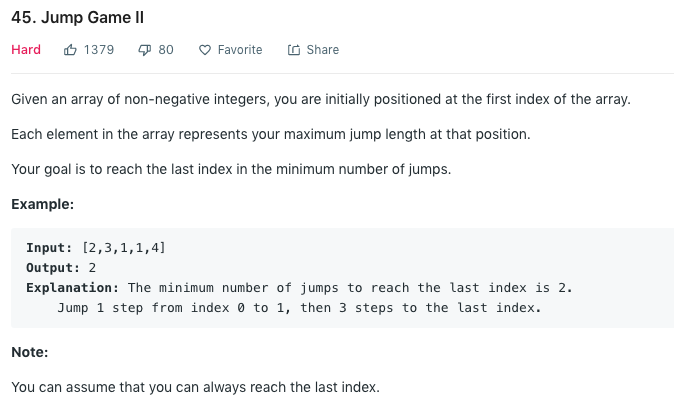
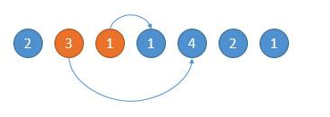
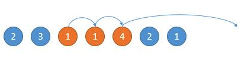

### Solution 1
Greedy. Everytime choose from the reachable places the position than can jump further.
For ex, start from 2, reachable range is orange. Jump to 3 as 3 can reach higher position. Next start from 3, as 4 can jump further, jump to 4.


```python
class Solution(object):
    def jump(self, nums):
        """
        :type nums: List[int]
        :rtype: int
        """
        steps, end, maxPos = 0, 0, 0
        # Note len(nums) - 1 , otherwise we will have an extra step at the last position
        for i in range(len(nums) - 1):
            maxPos = max(maxPos, i + nums[i])
            if i == end: #reach border, update border and step++
                steps += 1
                end = maxPos
        return steps 
```
+ Time complexity: O(n)
+ Space complexity: O(1)
### Solution 2
Backward. Starting from end, find the furthest position that can jump to it, then keep going on until we reach position 0.
```python
class Solution(object):
    def jump(self, nums):
        pos = len(nums) - 1
        steps = 0
        while pos != 0:
            for i in range(pos):
                if nums[i] + i >= pos:
                    pos = i
                    steps += 1
                    break
        
        return steps
```
+ Time complexity: O(n2) in the worst case like [1 1 1 1 1]
+ Space complexity: O(1)