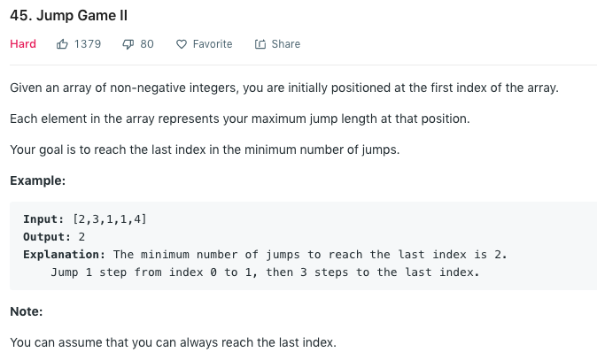
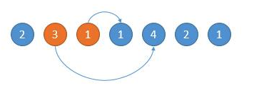
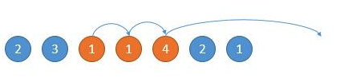

# Jump Game II

### Solution 1
Greedy. Everytime choose from the reachable places the position than can jump further.
For ex, start from 2, reachable range is orange. Jump to 3 as 3 can reach higher position. Next start from 3, as 4 can jump further, jump to 4.


```python
class Solution(object):
    def jump(self, nums):
        """
        :type nums: List[int]
        :rtype: int
        """
        steps, end, maxPos = 0, 0, 0
        # Note len(nums) - 1 , otherwise we will have an extra step at the last position
        for i in range(len(nums) - 1):
            maxPos = max(maxPos, i + nums[i])
            if i == end: #reach border, update border and step++
                steps += 1
                end = maxPos
        return steps 
```
or
```python
def jump(self, nums: List[int]) -> int:
    if len(nums) <= 1:
        return 0
    end, maxPos, step = 0, 0, 0
    for i in range(len(nums)):
        maxPos = max(maxPos, nums[i] + i)
        if maxPos >= len(nums) - 1:
            return step + 1
        if i == end:
            end = maxPos
            step += 1
```
+ Time complexity: O(n)
+ Space complexity: O(1)
### Solution 2
Backward. Starting from end, find the furthest position that can jump to it, then keep going on until we reach position 0.
```python
class Solution(object):
    def jump(self, nums):
        pos = len(nums) - 1
        steps = 0
        while pos != 0:
            for i in range(pos):
                if nums[i] + i >= pos:
                    pos = i
                    steps += 1
                    break
        
        return steps
```
+ Time complexity: O(n2) in the worst case like [1 1 1 1 1]
+ Space complexity: O(1)

>_justification_: let's say step from a to b is f(a, b), then f(0, n1) <= f(0, n2), n1 <= n2, so for f(0, n) = f(0, s) + f(s, n), we need to find the smallest s, f(s, n) = 1

### Solution 3 BFS
BFS: 1. add node to visited the first time enqueue (instead of dequeue) (say 2a, 2b in level 2, if 2a->2b exists, this would prevent us from enqueue 2b again when iterating 2a's neighbor)
2. note how do we keep record of current depth (alertativly create a depth queue, or simply remember the depth/parent node for each node along the path)
```python
def jump(nums):
    n = len(nums)
    if n < 2:
        return 0
    
    queue = [0]
    visited = set([0])#init queue and visited map with starting index 0
    lastElem = 0 #remember the last emelement in the current level, so we can increase depth
    res = 0

    while queue:
        cur = queue[0]
        step = nums[cur]
        if cur + step >= n-1: # handle depth when return early
            return res+1
        for i in range(1, step+1):
            if cur + i not in visited:
                queue.append(cur+i)
                visited.add(cur+i) #(1) mark visit when enqueue

        queue.pop(0)
        if cur == lastElem:
            res += 1
            lastElem = queue[-1] #(2) must first enqueue neighbor, then check if current node is the last in its level. otherwise, we would have no idea which node is the lastElem of the next level
```
or different ways to track level:
```python
def jump(nums: List[int]) -> int:
    if len(nums) <= 1: return 0
    queue = [0]
    visited = {0}
    jump = 0
    while queue:
        jump += 1
        for _ in range(len(queue)):
            pos = queue.pop(0)
            #pos = queue[0]
            if pos + nums[pos] >= len(nums)-1:
                return jump
            for p in range(pos+1, pos+nums[pos]+1):
                if p not in visited:
                    queue.append(p)
                    visited.add(p)
            #queue.pop(0)
```