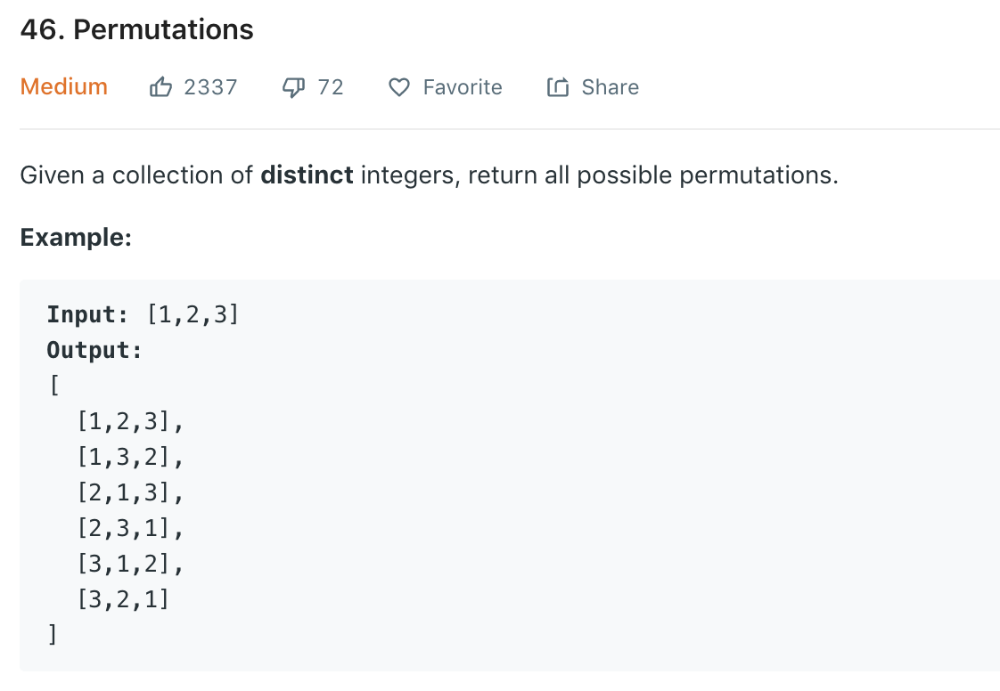

### Solution Backtracing
```python
class Solution(object):
    def permute(self, nums):
        """
        :type nums: List[int]
        :rtype: List[List[int]]
        """
        res = []
        def dfs(path, res, count):
            if count == 0:
                res.append(path)
                return
            for num in nums:
                if num not in path:
                    dfs(path + [num], res, count - 1)
        
        dfs([], res, len(nums))
        return res
```
Minor difference, with return value
```python
    def permute(self, nums):
    # return the total permutations using num in nums that's not in visited
        return self.dfs(nums, [])
    
    def dfs(self, nums, visited):
        res = []
        if len(visited) == len(nums):
            return res
        for i in range(len(nums)):
            if i not in visited:
                perms = self.dfs(nums, visited + [i])
                if not perms:
                 # suppose we only have one element in nums, then perms is None
                # so need to handle this condition here
                    res.append([nums[i]])
                for comb in perms:
                    res.append([nums[i]] + comb)
        return res
```