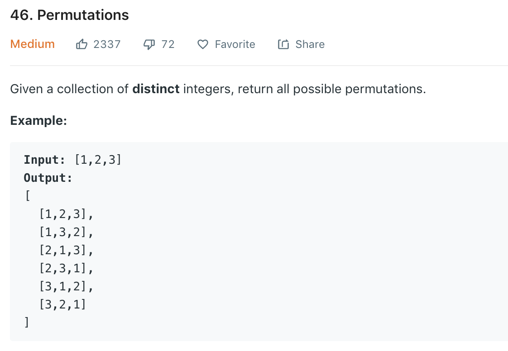

### Solution Backtracing
```python
class Solution(object):
    def permute(self, nums):
        """
        :type nums: List[int]
        :rtype: List[List[int]]
        """
        res = []
        def dfs(path, res, count):
            if count == 0:
                res.append(path)
                return
            for num in nums:
                if num not in path:
                    dfs(path + [num], res, count - 1)
        def dfs2(path, res):
            if len(path) == len(nums):
                res.append(path.copy())
                return
            for num in nums:
                if num not in path:
                    path.append(num)
                    dfs2(path, res)
                    path.pop()
        dfs([], res, len(nums))
        return res
```
or
```python
class Solution:
    def permute(self, nums: List[int]) -> List[List[int]]:
        res = []
        n = len(nums)
        def dfs(cur):
            if len(cur) == n:
                res.append(cur)
                return
            for num in nums:
                if num not in cur:
                    dfs(cur+[num])
        dfs([])
        return res
```
Minor difference, with return value
```python
    def permute(self, nums):
    # return the total permutations using num in nums that's not in visited
        return self.dfs(nums, [])
    
    def dfs(self, nums, visited):
        res = []
        if len(visited) == len(nums):
            return res
        for i in range(len(nums)):
            if i not in visited: #nums[i] is the first number picked
                perms = self.dfs(nums, visited + [i])
                if not perms:
                 # suppose we only have one element in nums, then perms is None
                # so need to handle this condition here
                    res.append([nums[i]])
                for comb in perms:
                    res.append([nums[i]] + comb)
        return res
    def dfs2(nums, visited):
        res = []
        for i in range(len(nums)):
            if i not in visited:
                #handle base condition differently
                if len(visited) == len(nums) - 1:
                    return [[nums[i]]]
                else:
                    perms = dfs(nums, visited+[i])
                    for perm in perms:
                        res.append([nums[i]]+perm)
        return res
```

or
```python
class Solution:
    def permute(self, nums: List[int]) -> List[List[int]]:
        if not nums:
            return [[]]
        perms = self.permute(nums[1:])
        res = []
        for perm in perms:
            for i in range(len(nums)):
                res.append(perm[:i]+[nums[0]]+perm[i:])
        return res
```