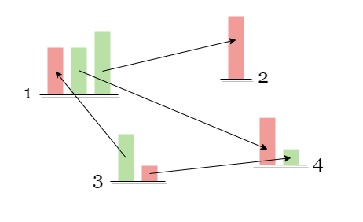
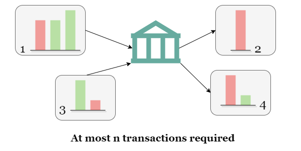
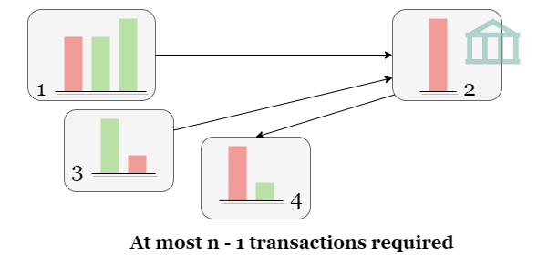
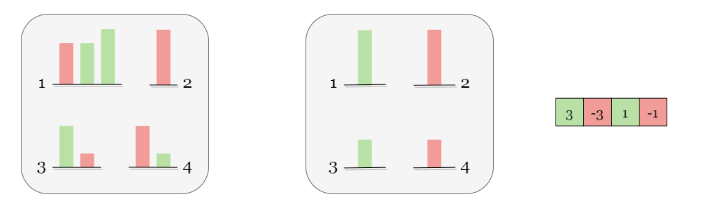
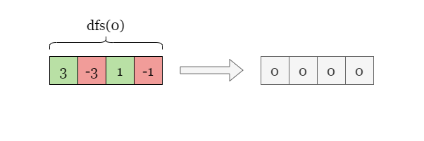
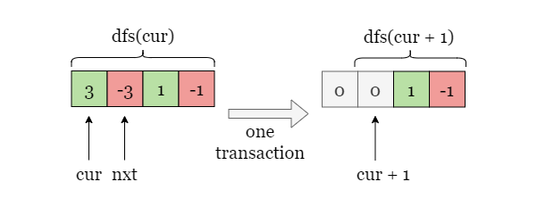
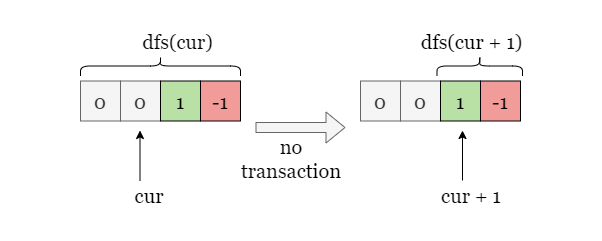
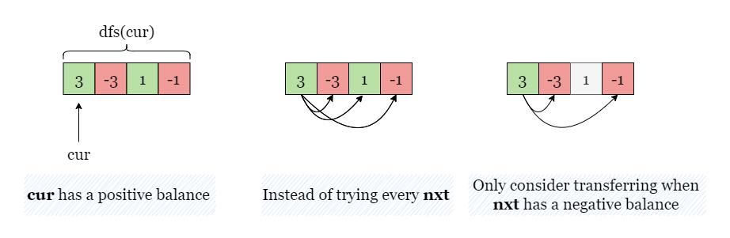

# Optimal account balancing
You are given an array of transactions transactions where transactions[i] = [fromi, toi, amounti] indicates that the person with ID = fromi gave amounti $ to the person with ID = toi.

Return the minimum number of transactions required to settle the debt.

Example 1:
Input: transactions = [[0,1,10],[2,0,5]]
Output: 2
Explanation:
Person #0 gave person #1 $10.
Person #2 gave person #0 $5.
Two transactions are needed. One way to settle the debt is person #1 pays person #0 and #2 $5 each.

Example 2:
Input: transactions = [[0,1,10],[1,0,1],[1,2,5],[2,0,5]]
Output: 1
Explanation:
Person #0 gave person #1 $10.
Person #1 gave person #0 $1.
Person #1 gave person #2 $5.
Person #2 gave person #0 $5.
Therefore, person #1 only need to give person #0 $4, and all debt is settled.

### Solution
Rather than focusing on the debt relationships between each pair of individuals, we can direct our attention towards the net balance of each person. For instance, person 1 is owed 5 by person 2, but owes 10 to person 3 and 10 to person 4. Therefore, person 1 owes a net 15.



As a result, we can envision an "institution" independent of all persons. If a person has a positive balance, he can clear his debt by transferring his balance to the institution in one transaction. Likewise, if a person has a negative balance, he can also clear his debt by withdrawing the owed balance from the institution in a single transaction. Therefore, it would take a maximum of n transactions to settle each person's debt.



Additionally, we can even let one of the n individuals act as the institution, so the other n−1 individuals can settle their debts in n−1 transactions. Since the total debt sum is 0, clearing the debts of the first n−1 individuals would automatically clear the debt of the n 
th person. Note that this idea applies to any group of people whose total debt sum is 0, not just all n individuals as a group.



Consequently, our initial step involves calculating the net balance of each person from all transactions. If a person's total balance is not zero, we store his net balance in a list.



If the list is empty, it implies that all persons have zero debt, and the problem can be solved with 0 transactions. Otherwise, we will proceed with working on the list of net balances.

### Solution 1 Backtracing
Approach 1: Backtracking
Intuition
If you are not familiar with recursion, please refer to our explore cards Recursion Explore Card. We will focus on the usage in this article and not the implementation details.

Let's define a recursive function dfs(cur) as the minimum number of transactions required to settle the debts of all persons in the range [cur:] of the list. For instance, dfs(0) represents the minimum number of transactions to settle all the debts. dfs(1) represents the minimum number of transactions to settle the debts of all people except the first.



As depicted in the figure, the person cur has a net balance of 3, we initiate a traversal of each person nxt from the subsequent position cur + 1 and attempt to transfer all of cur's debt to nxt. After the transfer, cur's debt is cleared, and we increment the number of transfers by 1. We then proceed to recursively process the next person cur + 1. In other words, dfs(cur) = 1 + dfs(cur + 1).



However, if person cur has zero balance, indicating that his debt has been cleared, and we proceed to the next person by calling dfs(cur + 1) with no transaction required: dfs(cur) = dfs(cur + 1).



We can optimize the algorithm further by only attempting to transfer cur's debt to individuals whose debts are non-zero and have the opposite sign to cur's debt. For instance, if cur's net balance is positive, we only consider individuals whose net balance is negative, and vice versa.




Algorithm
1. Create a hash map to store the net balance of each person.
2. Collect all non-zero net balance in an array balance_list.
3. Define a recursive function dfs(cur) to clear all balances in the range balance_list[0 ~ cur]:
4. Ignore cur if the balance is already 0. While balance_list[cur] = 0, proceed to the next person by incrementing cur by 1.
* If cur = n, return 0.
* Otherwise, set cost to a large integer like inf.
5. Traverse through the index of nxt from cur + 1, if balance_list[nxt] * balance_list[cur] < 0,
* add the balance of balance_list[cur] to balance_list[nxt]: balance_list[nxt] += balance_list[cur].
* recursively call dfs(cur + 1) as dfs(cur) = 1 + dfs(cur + 1).
* remove the previous transferred balance from cur: balance_list[nxt] -= balance_list[cur] (backtrack).

6. Repeat from step 5 and keep tracking of the minimum number of operations of cost = min(cost, 1 + dfs(cur + 1)) encountered in the iteration. Return cost when the iteration is complete.
7. Return dfs(0).

```python
class Solution:
    def minTransfers(self, transactions: List[List[int]]) -> int:
        balance_map = collections.defaultdict(int)
        for a, b, amount in transactions:
            balance_map[a] += amount
            balance_map[b] -= amount
        
        balance_list = [amount for amount in balance_map.values() if amount]
        n = len(balance_list)
        
        def dfs(cur):
            while cur < n and not balance_list[cur]:
                cur += 1
            if cur == n:
                return 0
            cost = float('inf')
            for nxt in range(cur + 1, n):
                # If nxt is a valid recipient, do the following: 
                # 1. add cur's balance to nxt.
                # 2. recursively call dfs(cur + 1).
                # 3. remove cur's balance from nxt.
                if balance_list[nxt] * balance_list[cur] < 0:
                    balance_list[nxt] += balance_list[cur]
                    cost = min(cost, 1 + dfs(cur + 1))
                    balance_list[nxt] -= balance_list[cur]
            return cost
        
        return dfs(0)
```
[4, -2, -4, 2]
0 [ -2, -4+4, 2]
0 0 [-4+4, 2-2]