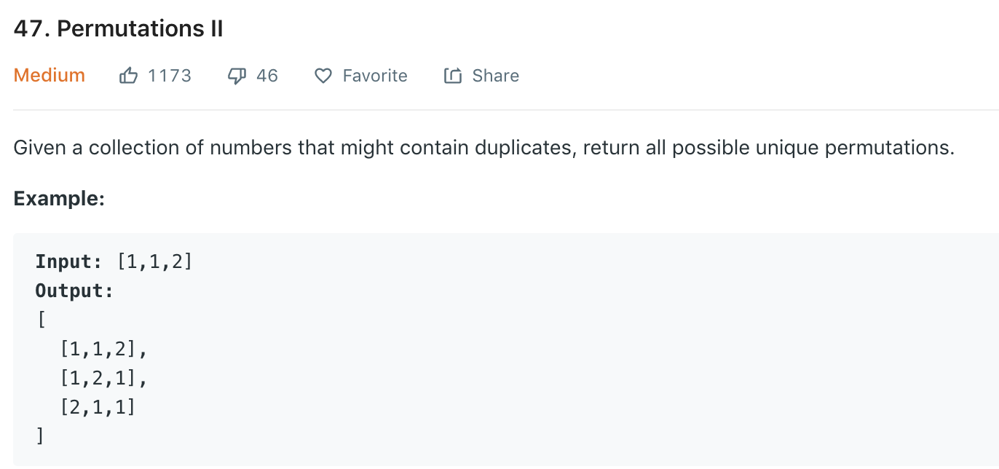

### Solution
Refer to [here](https://leetcode.com/problems/permutations-ii/discuss/18602/9-line-python-solution-with-1-line-to-handle-duplication-beat-99-of-others-%3A-).
```python
class Solution(object):
    # To handle duplication, just avoid inserting a number AFTER any of its duplicates.
    def permuteUnique(self, nums):
        """
        :type nums: List[int]
        :rtype: List[List[int]]
        """

        if len(nums) == 1:
            return [nums]

        # permute all elements except the first one
        perms = self.permuteUnique(nums[1:])
        value = nums[0]
        result = []

        for perm in perms:
            for j in range(len(perm) + 1):
                result.append(perm[:j] + [value] + perm[j:])

                # remove this if you want to include duplicates too...
                if j < len(perm) and perm[j] == value:
                    break

        return result
```