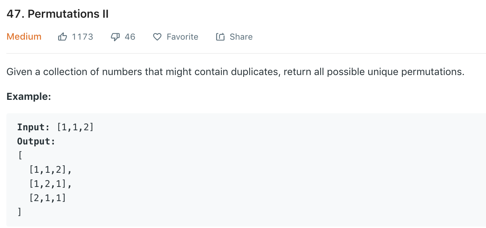

### Solution
Refer to [here](https://leetcode.com/problems/permutations-ii/discuss/18602/9-line-python-solution-with-1-line-to-handle-duplication-beat-99-of-others-%3A-).

for ex [1, 1, 2]
`       # [1, 2]
        # 1, 1, 2  discard | 1, 1, 2 | 1, 2, 1
        # [2, 1]
        # 1, 2, 1 | 2, 1, 1  discard | 2, 1, 1
`
```python
class Solution(object):
    # To handle duplication, just avoid inserting a number AFTER any of its duplicates.
    def permuteUnique(self, nums):
        """
        :type nums: List[int]
        :rtype: List[List[int]]
        """

        if len(nums) == 1:
            return [nums]

        # permute all elements except the first one
        perms = self.permuteUnique(nums[1:])
        value = nums[0]
        result = []

        for perm in perms:
            for j in range(len(perm) + 1):
                result.append(perm[:j] + [value] + perm[j:])

                # remove this if you want to include duplicates too...
                # (in combination: if i > start and nums[i] == nums[i-1])
                if j < len(perm) and perm[j] == value:
                    break

        return result
```

### Solution 2
Sort + backtrace
我们可以先对数组进行排序，这样就可以将重复的数字放在一起，方便我们进行去重。

然后，我们设计一个函数bfs(i), 表示当前需要填写第i个位置的数。函数的具体实现下：
如果i = n, 说明我们已经填写完毕，将当前排列加入答案数组中，然后返回。否则，我们枚举第i个位置的数nums[j],其中j的范围是[0, n-1].我们需要保证nums[j]没有被使用过，并且与前面枚举的数不同，这样才能保证当前排列不重复。如果满足条件，我们就可以填写nums[j]并继续递归地填写下一个位置，即调用dfs(i+1).
在递归调用结束后，我们需要将nums[j]标记为未使用，以便于进行后面的枚举。
在主函数中，我们首先对数组进行排序，然后调用dfs(0), 即从第 0 个位置开始填写，最终返回答案数组即可。

时间复杂度O(nxn!)，空间复杂度O(n). 其中n是数组的长度。需要进行n!次枚举，每次枚举需要O(n)的时间来判断是否重复。另外，我们需要一个标记数组来标记每个位置是否被使用过，因此空间复杂度为O(n)

```python
class Solution:
    def permuteUnique(self, nums: List[int]) -> List[List[int]]:
        def dfs(i: int):
            if i == n:
                ans.append(t[:])
                return
            for j in range(n):
                if vis[j] or (j and nums[j] == nums[j - 1] and not vis[j - 1]):
                    continue
                t[i] = nums[j]
                vis[j] = True
                dfs(i + 1)
                vis[j] = False

        n = len(nums)
        nums.sort()
        ans = []
        t = [0] * n
        vis = [False] * n
        dfs(0)
        return ans
```