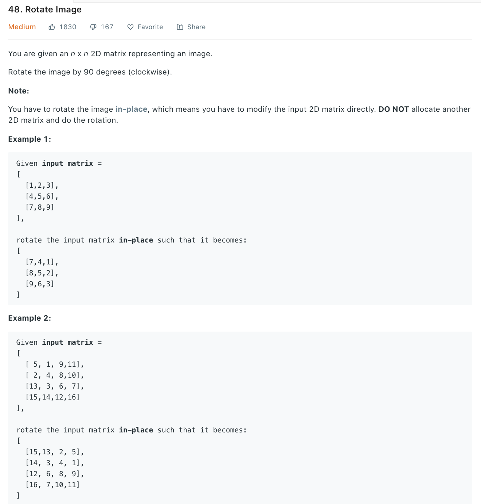

### Solution
* clockwise rotate:
first reverse up to down, then swap the symmetry (order can reverse)
```
1 2 3     7 8 9     7 4 1
4 5 6  => 4 5 6  => 8 5 2
7 8 9     1 2 3     9 6 3
```
* anticlockwise rotate:
first reverse left to right, then swap the symmetry
```
1 2 3     3 2 1     3 6 9
4 5 6  => 6 5 4  => 2 5 8
7 8 9     9 8 7     1 4 7
```
```python
class Solution(object):
    def rotate(self, matrix):
        """
        :type matrix: List[List[int]]
        :rtype: None Do not return anything, modify matrix in-place instead.
        """
        matrix.reverse()
        # i, j = 0, len(matrix) - 1
        # while i < j:
        #     temp = matrix[i]
        #     matrix[i] = matrix[j]
        #     matrix[j] = temp
        #     i += 1
        #     j -= 1

        for i in range(len(matrix)):
            for j in range(i+1, len(matrix[0])):
                matrix[i][j], matrix[j][i] = matrix[j][i], matrix[i][j]
```
Similarly
```python
def rotate(matrix):
    for i in range(len(matrix)):
        for j in range(i + 1, len(matrix[0])):
            matrix[i][j], matrix[j][i] = matrix[j][i], matrix[i][j]
    for l in matrix:
        l.reverse()
```
If we do it not in-place and just construct a new matrix
```python
def rotate(matrix):
    # equation orig (i, j) -> rotated (j, n - i)
    n = len(matrix)
    new_matrix = [[matrix[n - j - 1][i] for j in range(n)] for i in range(n)]
    return new_matrix

```