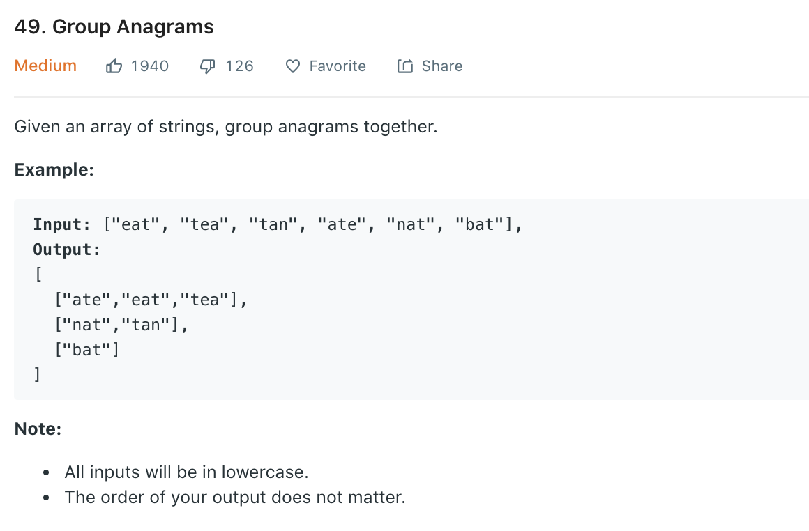

### Solution 1 TLE
For each str in strs, iterate over current anagram groups, see if it fits.
```python
class Solution(object):
    def groupAnagrams(self, strs):
        ret = []
        for str in strs:
            isUnioned = False
            for group in ret:
                if self.isAnagrams(str, group[0]):
                    group.append(str)
                    isUnioned = True
                    break
            if not isUnioned:
                ret.append([str])
        
        return ret
    def isAnagrams(self, str1, str2):
        if len(str1) != len(str2): return False
        
        count_buffer = collections.defaultdict(int)
        for i in range(len(str1)):
            count_buffer[str1[i]] += 1
            count_buffer[str2[i]] -= 1

        for char in count_buffer:
            if count_buffer[char] != 0:
                return False
        return True
```
### Solution 2 HashMap
Use sorted string as unique key to group anagrams
```python
class Solution(object):
    def groupAnagrams(self, strs):
        """
        :type strs: List[str]
        :rtype: List[List[str]]
        """
        map = dict()
        for str in strs:
            key = ''.join(sorted(str))
            if key in map:
                map[key].append(str)
            else:
                map[key] = [str]
        
        return list(map.values())
```
