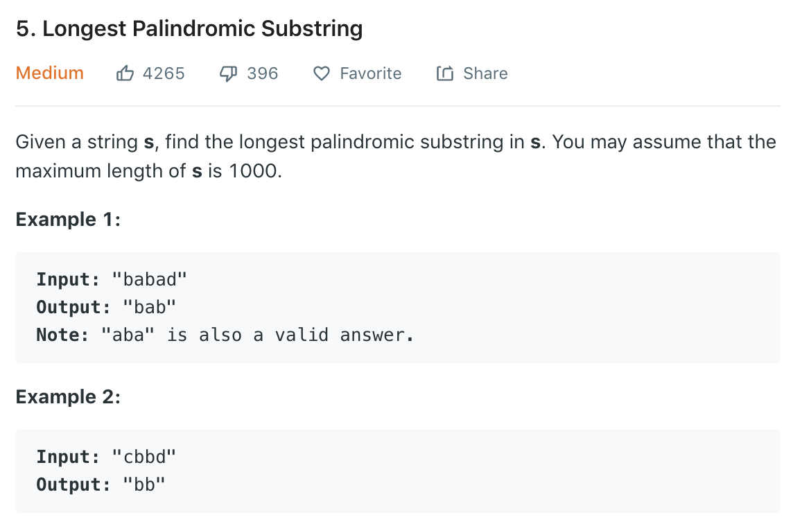

### Solution
```python
class Solution(object):
    def longestPalindrome(self, s):
        """
        :type s: str
        :rtype: str
        """
        if not s or len(s) < 2: return s
        
        max_len = 0
        left = 0
        
        for i in range(len(s) - 1):
            l1 = self.extendPalindrome(i, i, s)
            l2 = self.extendPalindrome(i, i + 1, s)
            if max(l1, l2) > max_len:
                if l1 > l2:
                    left = i - l1 // 2
                    max_len = l1
                else:
                    left = i - l2 // 2 + 1
                    max_len = l2
            
        return s[left: left + max_len]
    
    def extendPalindrome(self, l, r, s):
        while s[l] == s[r]:
            l -= 1
            r += 1
            if l < 0 or r >= len(s):
                break
        
        return r - l - 1
```
Similarly
```python
class Solution(object):
    def __init__(self):
        self.lo = 0
        self.maxLen = 0

    def longestPalindrome(self, s):
        """
        :type s: str
        :rtype: str
        """
        if (len(s) < 2):
            return s

        for i in range(len(s) - 1):
            self.extendParlindrome(s, i, i)
            self.extendParlindrome(s, i, i + 1)
        return s[self.lo:(self.lo + self.maxLen)]

    def extendParlindrome(self, s, j, k):
        while j >= 0 and k < len(s) and s[j] == s[k]:
            j -= 1
            k += 1
        if self.maxLen < k - j - 1:#(k-j+1)-2
            self.lo = j + 1
            self.maxLen = k - j - 1
```