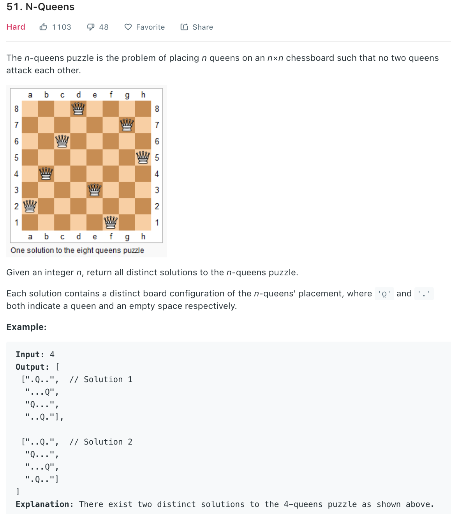

### Solution Backtracing
Classical N queens problem. Place n queens on the chess board s.t. there can exist only one queeen on each row, column and diagnal line. 
How to check if two queens are on the same diagnal line? x - y is the same for all nodes on the same main diagnal line. Similarly, x + y is the same on paradiagnal line.
```python
class Solution(object):
    def solveNQueens(self, n):
        ans = []
        self.backtrace([], ans, n)
        return ans

    def backtrace(self, curQueens, ans, n):
        if len(curQueens) == n:
            # has settled all n queens
            board = self.draw(curQueens)
            ans.append(board)
            return

        for col in range(n):
            # col conflict
            if not col in curQueens:
                if self.isDiagAttack(curQueens, col):
                    continue
                # curQueens.append(col)
                self.backtrace(curQueens + [col], ans, n)
                # curQueens.pop()

    def draw(self, lst):
        # draw chess board according to queen pos in each line
        board = []
        for pos in lst:
            line = ['.']*len(lst)
            line[pos] = 'Q'
            board.append(''.join(line))
        return board

    def isDiagAttack(self, curQueens, i):
        curRow = len(curQueens)
        for row in range(curRow):
            # left diag or right diag
            if abs(curRow - row) == abs(i - curQueens[row]):
                return True

        return False
```
More concise
```python
class Solution(object):
    def solveNQueens(self, n):
        """
        :type n: int
        :rtype: List[List[str]]
        """
        res = []

        def dfs(queens, ddiff, ssum):
            p = len(queens)
            if p == n:
                queens = ['.' * i + 'Q' + '.' * (n - 1 - i) for i in queens]
                res.append(queens)
                return
            for q in range(n):
                if q in queens or p - q in ddiff or p + q in ssum: continue
                dfs(queens + [q], ddiff + [p - q], ssum + [p + q])
        dfs([], [], [])
        return res
```