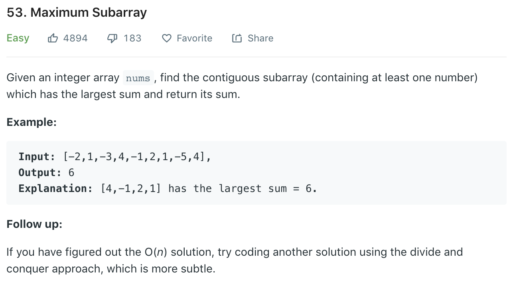

### Solution DP
```python
class Solution(object):
    def maxSubArray(self, nums):
        """
        :type nums: List[int]
        :rtype: int
        """
        if not nums:
            return 0
        n = len(nums)
        dp = [0] * n
        maxSum = dp[0] = nums[0]

        for i in range(1, n):
            dp[i] = nums[i]
            if i > 0 and dp[i - 1] > 0:
                dp[i] += dp[i - 1]
            maxSum = dp[i] if dp[i] > maxSum else maxSum
        
        return maxSum
```
Space optimization
```python
class Solution(object):
    def maxSubArray(self, nums):
        prevSum = nums[0]
        maxSum = prevSum
        
        for i in range(1, len(nums)):
            prevSum = prevSum + nums[i] if prevSum > 0 else nums[i]
            maxSum = max(maxSum, prevSum)
            
        return maxSum
```