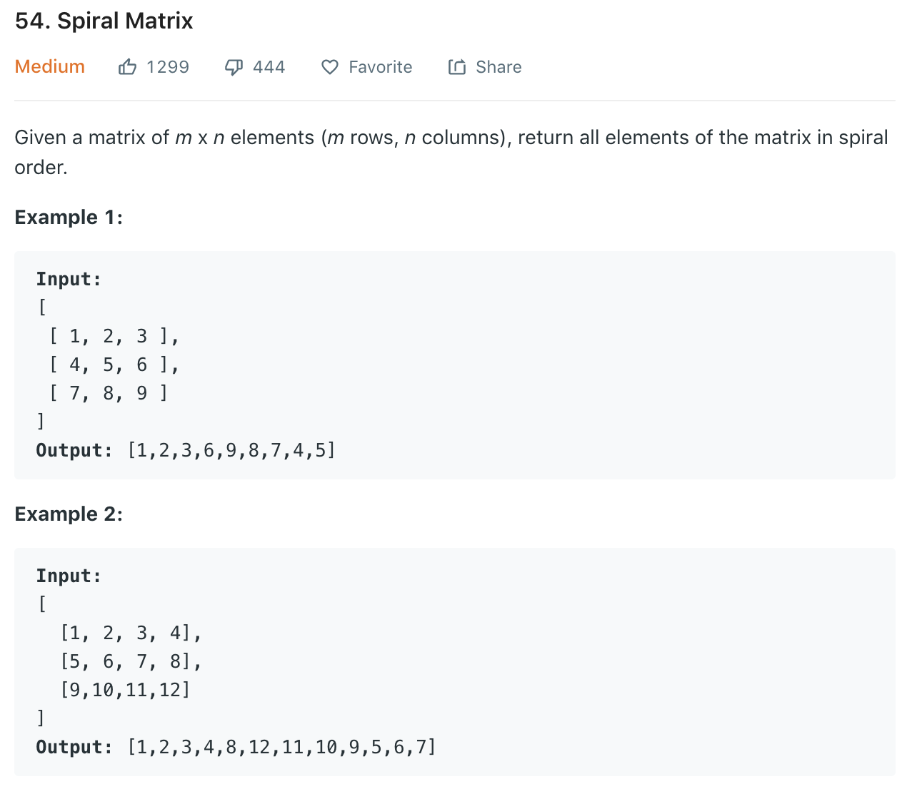

Similar to [59](59.md).
### Solution 1
Note we need to check if condition satisfied every time we change direction. 
```python
class Solution(object):
    def spiralOrder(self, matrix):
        """
        :type matrix: List[List[int]]
        :rtype: List[int]
        """
        if not matrix: return []
        
        res = []
        rowS, rowE, colS, colE = 0, len(matrix), 0, len(matrix[0])
        while rowS < rowE and colS < colE:
#             move right
            for j in range(colS, colE):
                res.append(matrix[rowS][j])
            rowS += 1
#             move down
            if colS < colE:
                for i in range(rowS, rowE):
                    res.append(matrix[i][colE - 1])
                colE -= 1
#             move left
            if rowS < rowE:
                for j in reversed(range(colS, colE)):
                    res.append(matrix[rowE - 1][j])
                rowE -= 1
#             move up
            if colS < colE:
                for i in reversed(range(rowS, rowE)):
                    res.append(matrix[i][colS])
                colS += 1
        
        return res
```
or
```python
class Solution:
    def spiralOrder(self, matrix: List[List[int]]) -> List[int]:
        if not matrix or not matrix[0]:
            return []
        
        top, bottom = 0, len(matrix) - 1
        left, right = 0, len(matrix[0]) - 1
        res = []
        
        while top <= bottom and left <= right:
            # 1. 向右 (Top)
            for j in range(left, right + 1):
                res.append(matrix[top][j])
            top += 1
            
            # 2. 向下 (Right)
            for i in range(top, bottom + 1):
                res.append(matrix[i][right])
            right -= 1
            
            if top <= bottom: # 必须检查，防止只有单行时重复遍历
                # 3. 向左 (Bottom)
                for j in range(right, left - 1, -1):
                    res.append(matrix[bottom][j])
                bottom -= 1
                
            if left <= right: # 必须检查，防止只有单列时重复遍历
                # 4. 向上 (Left)
                for i in range(bottom, top - 1, -1):
                    res.append(matrix[i][left])
                left += 1
                
        return res
```
### Solution 2
```python
def spiralOrder(matrix):
    if not matrix: return []
    m, n = len(matrix), len(matrix[0])

    read = [[False] * n for _ in range(m)]
    res = []
    i, j, di, dj = 0, 0, 0, 1

    for _ in range(m * n):
        res.append(matrix[i][j])
        read[i][j] = True
        if read[(i + di) % m][(j + dj) % n]:
            di, dj = dj, -di
        i += di
        j += dj

    return res
```