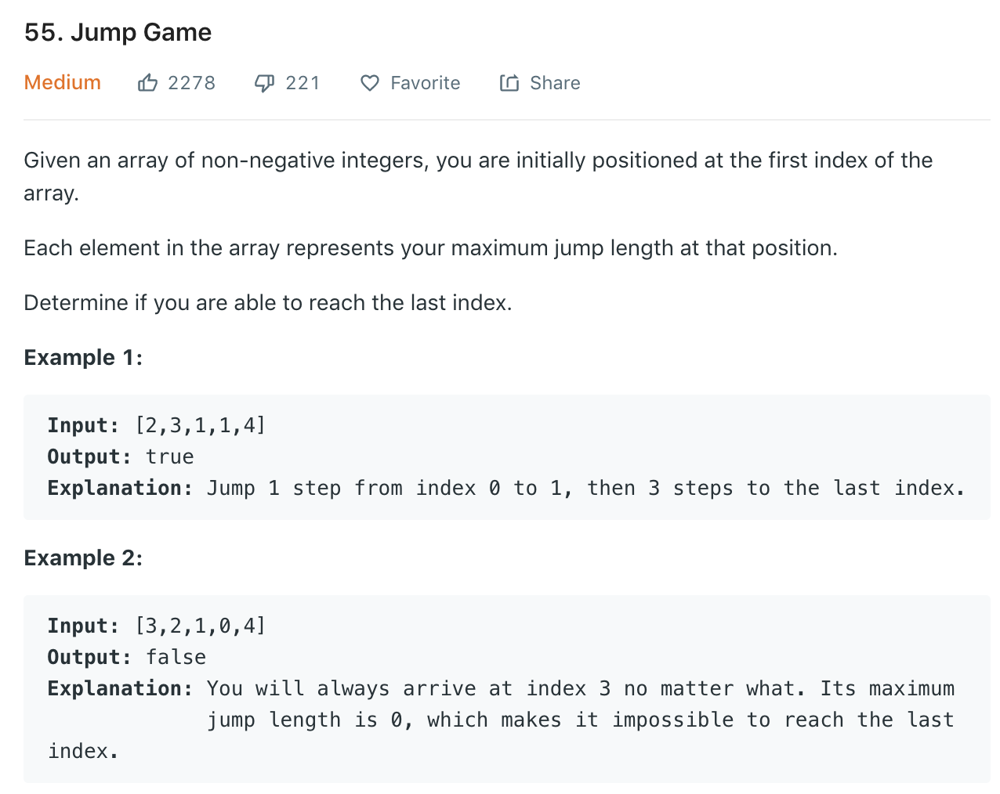

Similar to [45](45.md).
### Solution
Just consider of elements before 0 and jump after 0.
```python
class Solution(object):
    def canJump(self, nums):
        maxPos = 0
        for i in range(len(nums)):
            if nums[i] == 0 and i >= maxPos:
                return False
            maxPos = max(maxPos, nums[i] + i)
        
        return True
```
We don't even need to consider position of 0, just need to compare if current maxPos > current i.
```python
class Solution(object):
    def canJump(self, nums):
        """
        :type nums: List[int]
        :rtype: bool
        """
        maxPos = 0
        for i in range(len(nums)):
            if maxPos < i:
                return False
            maxPos = max(maxPos, i + nums[i])
        
        return True
```