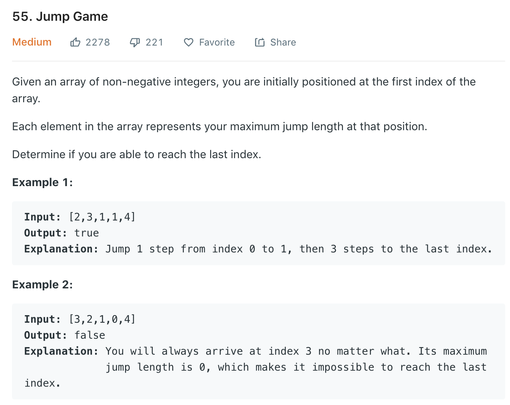

# Jump Game

Similar to [45](45.md).
### Solution
(note BFS would be overkill here) Just consider of elements before 0 and jump after 0.
```python
class Solution(object):
    def canJump(self, nums):
        maxPos = 0
        for i in range(len(nums)):
            if nums[i] == 0 and i >= maxPos:
                return False
            maxPos = max(maxPos, nums[i] + i)
        
        return True
```
We don't even need to consider position of 0, just need to compare if current maxPos > current i.
```python
class Solution(object):
    def canJump(self, nums):
        """
        :type nums: List[int]
        :rtype: bool
        """
        maxPos = 0
        for i in range(len(nums)):
            if maxPos < i:
                return False
            maxPos = max(maxPos, i + nums[i])
        
        return True
``` 

with some early return:
```python
def canJump(nums: List[int]) -> bool:
    curMax = 0
    n = len(nums)
    for i in range(n-1): # we don't care if the digit is 0 as it's already in destination
        curMax = max(i + nums[i], curMax)
        if curMax >= n-1:
            return True
        #if i >= curMax && nums[i] == 0:
        if i == curMax: # stopped here
            return False
    return True   
```
or 
```python
def canJump(nums: List[int]) -> bool:
    maxPos = 0
    for i in range(len(nums)):
        if i > maxPos:
            return False
        maxPos = max(maxPos, i + nums[i])
        if maxPos >= len(nums) - 1: # early return
            return True
```