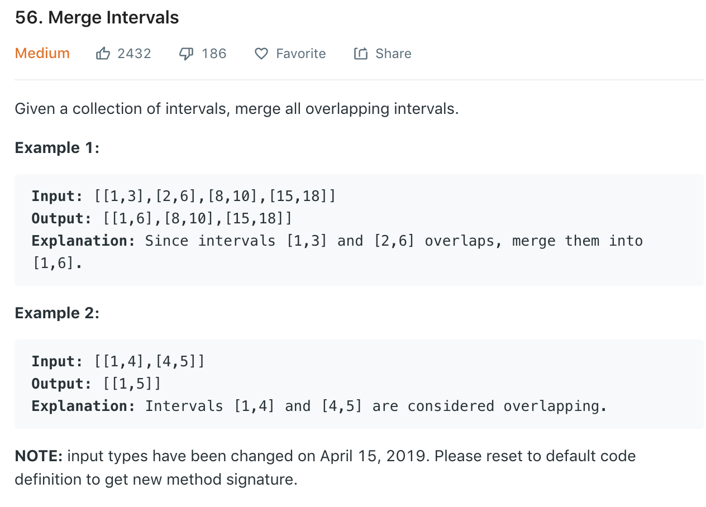

### Solution
```python
class Solution(object):
	def merge(self, intervals):
		"""
		:type intervals: List[List[int]]
		:rtype: List[List[int]]
		"""
		res = []
		intervals.sort(key=lambda x: x[0])

		for interval in intervals:
            # disjoint intervals
			if not res or interval[0] > res[-1][1]:
				res.append(interval)
            # ovelapping intervals
			else:
				res[-1][1] = max(interval[1], res[-1][1])
		return res
```