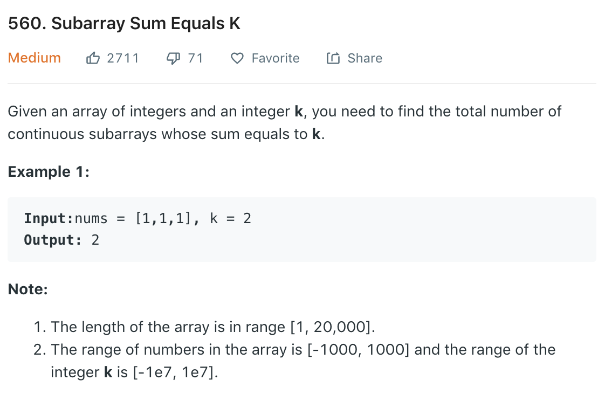

### Solution 1 BF TLE
```python
class Solution(object):
    def subarraySum(self, nums, k):
        """
        :type nums: List[int]
        :type k: int
        :rtype: int
        """
        count = 0
        for i in range(len(nums)):
            curSum = 0
            # check subarray starting at i
            for j in range(i, len(nums)):
                curSum += nums[j]
                if curSum == k:
                    count += 1

        return count
```
### Solution prefixSum + 2 sum
Refer to [here](https://leetcode.com/problems/subarray-sum-equals-k/discuss/190674/Python-O(n)-Based-on-%22running_sum%22-concept-of-%22Cracking-the-coding-interview%22-book) and [here](https://leetcode.com/problems/subarray-sum-equals-k/discuss/102106/Java-Solution-PreSum-%2B-HashMap).

Use an array to store the sum, now the problem becomes find two items from this sums array so that sums[j]-sums[i] = k (similar to two sum). We can easily optimize this to O(1).
```python
def subarraySum(nums, k):
    running_sum = 0
    hash_table = collections.defaultdict(int)
    total = 0
    for x in nums:
        running_sum += x
        sum = running_sum - k
        if sum in hash_table:
            total += hash_table[sum]
        if running_sum == k:
            total += 1
        hash_table[running_sum] += 1
    return total
```

```python
def subarraySum(nums, k):
    sumMap = {0:1}
    preSum = 0
    res = 0

    for num in nums:
        preSum += num
        if preSum - k in sumMap:
            res += sumMap[preSum - k]
        sumMap[preSum] = sumMap.get(preSum, 0) + 1

    return res
```