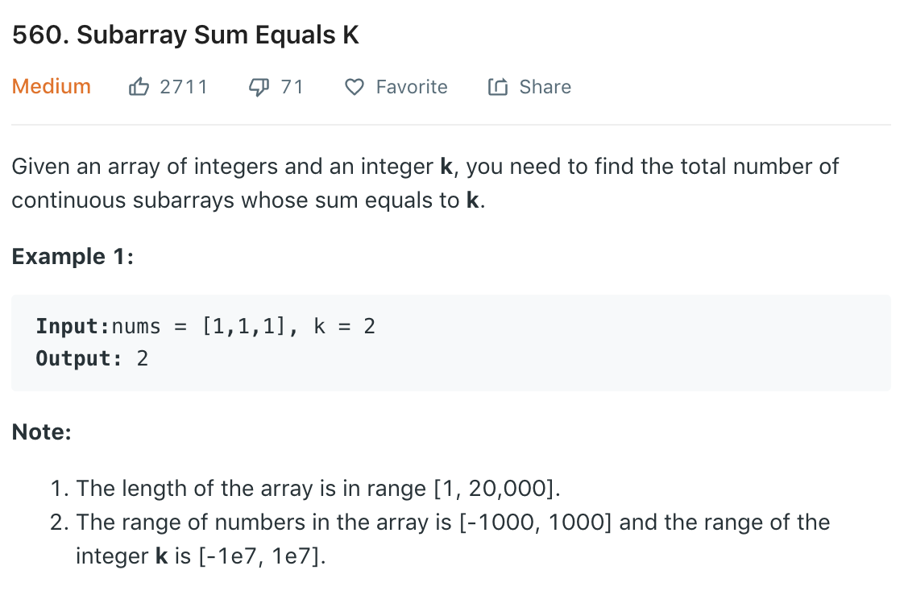

### Solution 1 BF TLE
```python
class Solution(object):
    def subarraySum(self, nums, k):
        """
        :type nums: List[int]
        :type k: int
        :rtype: int
        """
        count = 0
        for i in range(len(nums)):
            curSum = 0
            # check subarray starting at i
            for j in range(i, len(nums)):
                curSum += nums[j]
                if curSum == k:
                    count += 1

        return count
```
### Solution prefixSum + 2 sum
Refer to [here](https://leetcode.com/problems/subarray-sum-equals-k/discuss/190674/Python-O(n)-Based-on-%22running_sum%22-concept-of-%22Cracking-the-coding-interview%22-book) and [here](https://leetcode.com/problems/subarray-sum-equals-k/discuss/102106/Java-Solution-PreSum-%2B-HashMap).

Use an array to store the sum, now the problem becomes find two items from this sums array so that sums[j]-sums[i] = k (similar to two sum). We can easily optimize this to O(1).
```python
def subarraySum(nums, k):
    running_sum = 0
    hash_table = collections.defaultdict(int)
    total = 0
    for x in nums:
        running_sum += x
        sum = running_sum - k
        if sum in hash_table:
            total += hash_table[sum]
        if running_sum == k:
            total += 1
        hash_table[running_sum] += 1
    return total
```

```python
def subarraySum(nums, k):
    sumMap = {0:1}
    preSum = 0
    res = 0

    for num in nums:
        preSum += num
        if preSum - k in sumMap:
            res += sumMap[preSum - k]
        sumMap[preSum] = sumMap.get(preSum, 0) + 1

    return res
```

在 LeetCode 560（和为 K 的子数组）中，**“先检查 Map，后更新 Map”** 的逻辑是实现准确性的关键。这与你之前提到的“跳跃”或“路径”问题有着本质的区别。

让我们拆解其中的核心逻辑：

### 1. 为什么必须“先检查、后更新”？

在 560 题中，我们要寻找的是 `prefixSum[j] - prefixSum[i] = k`，即 `prefixSum[i] = prefixSum[j] - k`。

* **逻辑本质**：我们在遍历到 `j` 时，是在问：“在我之前走过的所有路径中，有没有一个点的累加和恰好等于 `currentSum - k`？”
* **如果先更新（先 `put` 进去）**：
    * 如果 `k = 0`，当你检查 `prefixSum[j] - k` 时，你会把自己（当前的 `prefixSum[j]`）也算进去。
    * **后果**：这会错误地把“长度为 0 的空子数组”也算作一个合法的子数组。
    * **原则**：为了防止自己匹配自己，我们必须确保找到的是**“之前某个位置”**的 `prefixSum`。


---

### 2. 为什么它和“跳跃问题 (Jump Game)”的逻辑不同？

你在跳跃问题中看到的“更新”可能更侧重于**状态更新（Update State）**，而在 560 题中，Map 扮演的是**历史记录（Historical Record）**。

* **跳跃问题 (Jump Game)**：我们通常在更新“能到达的最远距离”。这是一个**动态覆盖过程**，你是在更新全局状态，而不是匹配历史状态。
* **子数组和问题 (560)**：这是一个**配对过程**。每一个 `prefixSum` 都是一个历史锚点。
    * `prefixSumMap` 里的每一个键值对 `sum: count` 告诉你：“在历史上，和为 `sum` 的位置出现了 `count` 次”。
    * 当你执行 `map[currentSum]++` 时，你是在往这个历史档案里添加一条新记录。如果你先添加，就是在问“历史档案里有没有这个值”，但你的档案里已经多了一个“此时此刻”的副本。

---

### 3. 逻辑对比：谁在“匹配”谁？

| 场景 | 动作顺序 | 原因 |
| :--- | :--- | :--- |
| **LeetCode 560** | **先检查，后更新** | 避免匹配到当前点本身，确保子数组长度 $\ge 1$。 |
| **跳跃问题/动态规划** | **先更新，后检查 (或同步)** | 通常是在计算“到达此点后能做出的最优选择”，目的是为了后续步骤使用。 |


### 一个简单的可视化心法：

* **如果是为了“找组合” (Find Pairs)**：必须**先查再记**。因为我们要找的是“我的合作伙伴”（那个 `currentSum - k`），而我不能和自己配对。
* **如果是为了“算路径/跳跃” (Path/Jump)**：通常是**边走边记**。因为我们需要实时更新“我目前能站到的最高点”，以便后面的人能踩在我的肩膀上。

**总结一下：** 在 560 题里，`prefixSumMap` 就像是一个**“访客记录本”**。你进门（遍历到当前点）时，先看看本子上有没有人跟你“对暗号”（`currentSum - k`），如果有，说明你和那个人之间夹着的这一段路就是我们要的 `k`；然后再把你自己的名字记进本子里。

**你现在觉得这种“先查询、后入库”的模式，是不是其实就是“寻找历史上的同伴”的过程？如果 `k` 变了，或者规则变成“寻找子数组和为奇数”，你觉得这个 `prefixSum` 的逻辑还需要改动吗？**