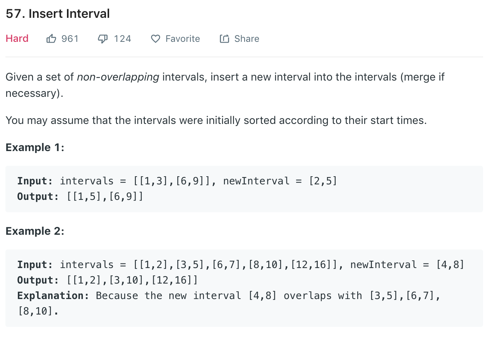

# Insert Interval

### Solution
```python
class Solution(object):
    def insert(self, intervals, newInterval):
        """
        :type intervals: List[List[int]]
        :type newInterval: List[int]
        :rtype: List[List[int]]
        """
        res = []
        start, end = newInterval[0], newInterval[1]
        n = len(intervals)
        i = 0
        #         all intvls that end before newInterval starts
        while i < n and intervals[i][1] < start:
            res.append(intervals[i])
            i += 1
        #         merge overlapping
        while i < n and intervals[i][0] <= end:
            newInterval[0] = min(newInterval[0], intervals[i][0])
            newInterval[1] = max(newInterval[1], intervals[i][1])
            i += 1
        res.append(newInterval)
        #         add all rest
        while i < n:
            res.append(intervals[i])
            i += 1

        return res
```
```python
class Solution(object):
    def insert(self, intervals, newInterval):
        res = []

        if not intervals:
            res.append(newInterval)
            return res

        curS, curE = newInterval[0], newInterval[1]

        for interval in intervals:
            lastS, lastE = interval[0], interval[1]
            if lastS > curE:
                res.append([curS, curE])
                curS, curE = lastS, lastE
            elif lastE < curS:
                res.append(interval)
            else:
                curS, curE = min(lastS, curS), max(curE, lastE)
        res.append([curS, curE])

        return res
```

or
我们可以先将新区间 newInterval 加入到区间列表 intervals 中，然后按照区间合并的常规方法进行合并。

时间复杂度O(nlogn), space complexity: O(n)
```python
class Solution:
    def insert(
        self, intervals: List[List[int]], newInterval: List[int]
    ) -> List[List[int]]:
        def merge(intervals: List[List[int]]) -> List[List[int]]:
            intervals.sort()
            ans = [intervals[0]]
            for s, e in intervals[1:]:
                if ans[-1][1] < s:
                    ans.append([s, e])
                else:
                    ans[-1][1] = max(ans[-1][1], e)
            return ans

        intervals.append(newInterval)
        return merge(intervals)
```

我们可以遍历区间列表 intervals，记当前区间为 interval，对于每个区间有三种情况：

1.当前区间在新区间的右侧，即newInterval[1此 < interval[0], 时如果新区间还没有被加入，那么将新区间加入到答案中，然后将当前区间加入到答案中。
2.当前区间在新区间的左侧，即interval[1] < newInterval[0], 此时将当前区间加入到答案中。
3.否则，说明当前区间与新区间有交集，我们取当前区间的左端点和新区间的左端点的最小值，以及当前区间的右端点和新区间的右端点的最大值，作为新区间的左右端点，然后继续遍历区间列表。
遍历结束，如果新区间还没有被加入，那么将新区间加入到答案中。
time complexity: O(n), space complexity: O(1)
```python
class Solution:
    def insert(
        self, intervals: List[List[int]], newInterval: List[int]
    ) -> List[List[int]]:
        st, ed = newInterval
        ans = []
        insert = False
        for s, e in intervals:
            if ed < s:
                if not insert:
                    ans.append([st, ed])
                    insert = True
                ans.append([s, e])
            elif e < st:
                ans.append([s, e])
            else:
                st = min(st, s)
                ed = max(ed, e)
        if not insert:
            ans.append([st, ed])
        return ans
```