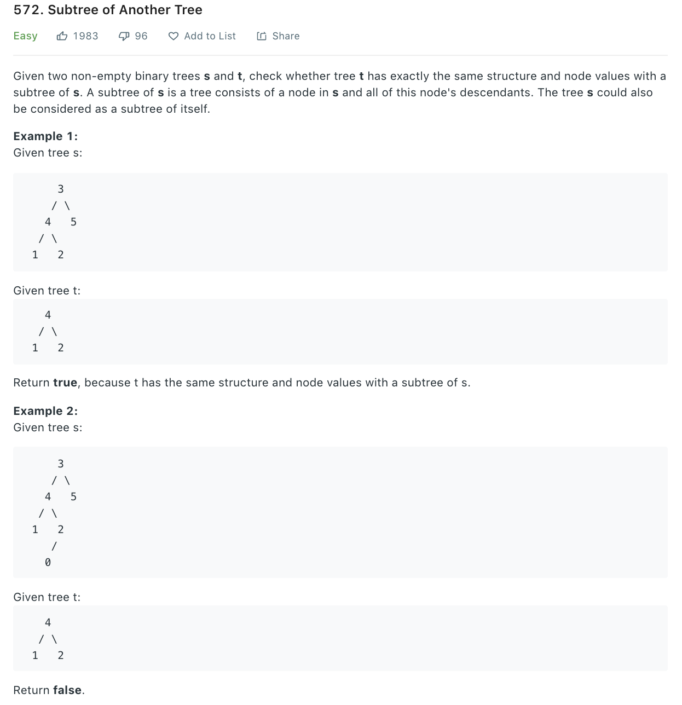

```python
class Solution(object):
    def isSubtree(self, s, t):
        """
        :type s: TreeNode
        :type t: TreeNode
        :rtype: bool
        """
        # if not s or not t: return s is t
        # t is not subtree of None (we reached the end of s, no matching)
        if not s : return False

        if self.isSameTree(s, t): return True
        
        return self.isSubtree(s.left, t) or self.isSubtree(s.right, t)
            
            
    def isSameTree(self, r1, r2):
        if not r1 or not r2: return r1 is r2
        if r1.val != r2.val:
            return False
        return self.isSameTree(r1.left, r2.left) and self.isSameTree(r1.right, r2.right)
```
### Differently, HasSubTree
Given 2 binary tree A, B, check if B is a sub-structure of A. (note we have empty tree is not sub-structure of any tree)
```
    8
   / \
   8 7
  /\
 9  2
    /\
   4  7    [8, 9, 2] is true

       8
       /
      8
     /
    9
   /
   2
  /
  5         [8, 9, #, 3] is false 
```
```python
class Solution:
    def HasSubtree(self, r1, r2):
        # if r2 is empty, then return False by regulation
        # if r2 is not empty, r1 is empty, then false
        if not r2 or not r1: return False

    # r1, r2 both have value when first time entering (may be empty later when reentrying)
        return self.helper(r1, r2) or self.helper(r1.left, r2) or self.helper(r1.right, r2)

    def helper(self, r1, r2):
        # if r1 reaches None
        if not r1:
            # r2 must also finishes matching all nodes
            return not r2

        # if r2 reaches the end, it is a sub-structure of r1 
        # NOTE: r1 can still have remaining non-empty nodes
        if not r2: return True

        if r1.val != r2.val: return False
        return self.helper(r1.left, r2.left) and self.helper(r1.right, r2.right)
```