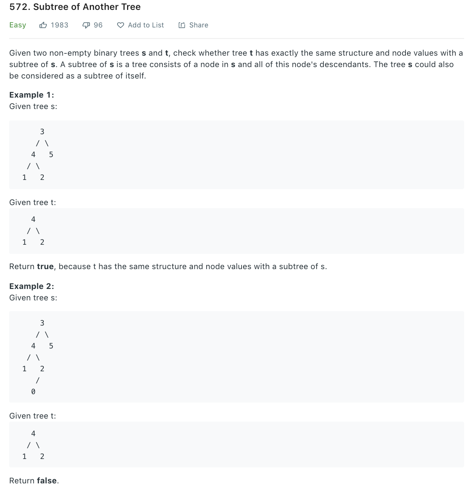

# Subtree of Another Tree

### DFS
```python
class Solution(object):
    def isSubtree(self, s, t):
        """
        :type s: TreeNode
        :type t: TreeNode
        :rtype: bool
        """
        # if not s or not t: return s is t
        # t is not subtree of None (we reached the end of s, no matching)
        if not s : return False

        if self.isSameTree(s, t): return True
        
        return self.isSubtree(s.left, t) or self.isSubtree(s.right, t)
            
            
    def isSameTree(self, r1, r2):
        if not r1 or not r2: return r1 is r2
        if r1.val != r2.val:
            return False
        return self.isSameTree(r1.left, r2.left) and self.isSameTree(r1.right, r2.right)
```
time: O(m*n), space: O(m+n), m is number of nodes in subRoot and n is number of nodes in root

### Serialization and oattern matching
Instead of comparing trees directly, we can first turn each tree into a string and then just check whether one string is contained in the other.

Serialize both root and subRoot into strings using the same traversal (for example, preorder).
While serializing, we must include markers for null children (like #) and separators (like $) so different shapes don't accidentally look the same in the string.
Once we have:
S_root = serialization of the main tree
S_sub = serialization of the subtree
the problem becomes:
"Is S_sub a substring of S_root?"
To efficiently check this, we can use a linear-time pattern matching algorithm (like Z-function or KMP) instead of naive substring search.

```python
class Solution:
    def serialize(self, root: Optional[TreeNode]) -> str:
        if root == None:
            return "$#"

        return ("$" + str(root.val) + self.serialize(root.left) + self.serialize(root.right))

    def z_function(self, s: str) -> list:
        z = [0] * len(s)
        l, r, n = 0, 0, len(s)
        for i in range(1, n):
            if i <= r:
                z[i] = min(r - i + 1, z[i - l])
            while i + z[i] < n and s[z[i]] == s[i + z[i]]:
                z[i] += 1
            if i + z[i] - 1 > r:
                l, r = i, i + z[i] - 1
        return z

    def isSubtree(self, root: Optional[TreeNode], subRoot: Optional[TreeNode]) -> bool:
        serialized_root = self.serialize(root)
        serialized_subRoot = self.serialize(subRoot)
        combined = serialized_subRoot + "|" + serialized_root

        z_values = self.z_function(combined)
        sub_len = len(serialized_subRoot)

        for i in range(sub_len + 1, len(combined)):
            if z_values[i] == sub_len:
                return True
        return False
```

### Differently, HasSubTree
Given 2 binary tree A, B, check if B is a sub-structure of A. (note empty tree is not sub-structure of any tree)
```
    8
   / \
   8 7
  /\
 9  2
    /\
   4  7    [8, 9, 2] is true

       8
       /
      8
     /
    9
   /
   2
  /
  5         [8, 9, #, 3] is false 
```
```python
class Solution:
    def HasSubtree(self, r1, r2):
        # if r2 is empty, then return False by regulation
        # if r2 is not empty, r1 is empty, then false
        if not r2 or not r1: return False

    # r1, r2 both have value when first time entering (may be empty later when reentrying)
        return self.helper(r1, r2) or self.helper(r1.left, r2) or self.helper(r1.right, r2)

    def helper(self, r1, r2):
        # if r1 reaches None
        if not r1:
            # r2 must also finishes matching all nodes
            return not r2

        # if r2 reaches the end, it is a sub-structure of r1 
        # NOTE: r1 can still have remaining non-empty nodes
        if not r2: return True

        if r1.val != r2.val: return False
        return self.helper(r1.left, r2.left) and self.helper(r1.right, r2.right)
```