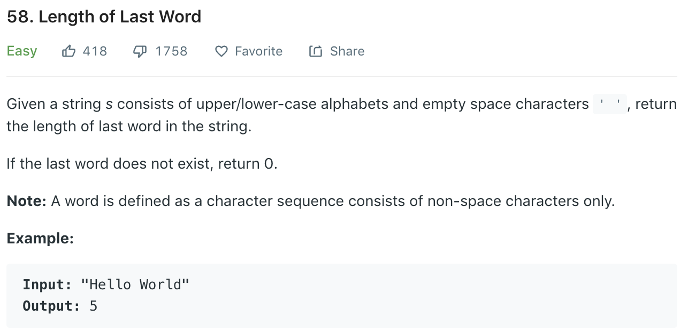

### Solution
```python
class Solution(object):
    def lengthOfLastWord(self, s):
        """
        :type s: str
        :rtype: int
        """
        index = len(s) - 1
        count = 0

        # get to end of last word
        while index >= 0 and s[index] == ' ':
            index -= 1
        # get to start of last word 
        while index >= 0 and s[index] != ' ':
            count += 1
            index -= 1
        return count
```
OR
```python
class Solution(object):
    def lengthOfLastWord(self, s):
        return len(s.strip().split(" ")[-1])
```