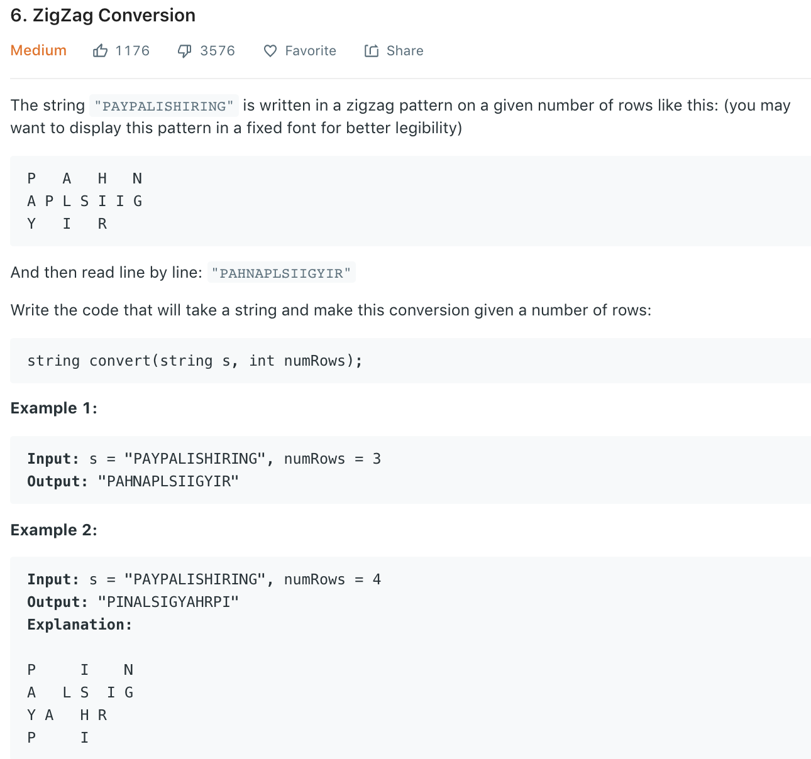

### Solution
```python
class Solution(object):
    def convert(self, s, numRows):
        """
        :type s: str
        :type numRows: int
        :rtype: str
        """
        if numRows == 1: return s
        
        # DONOT use res = [[]] * numRows, as copy reference
        res = [[] for _ in range(numRows)]
        di = -1
        
        row = 0
        for i in range(len(s)):
            # change direction everytime reach first or last line 
            if row == numRows - 1 or row == 0:
                di = -di
            res[row].append(s[i])
            row += di

        return ''.join([''.join(row) for row in res])
```