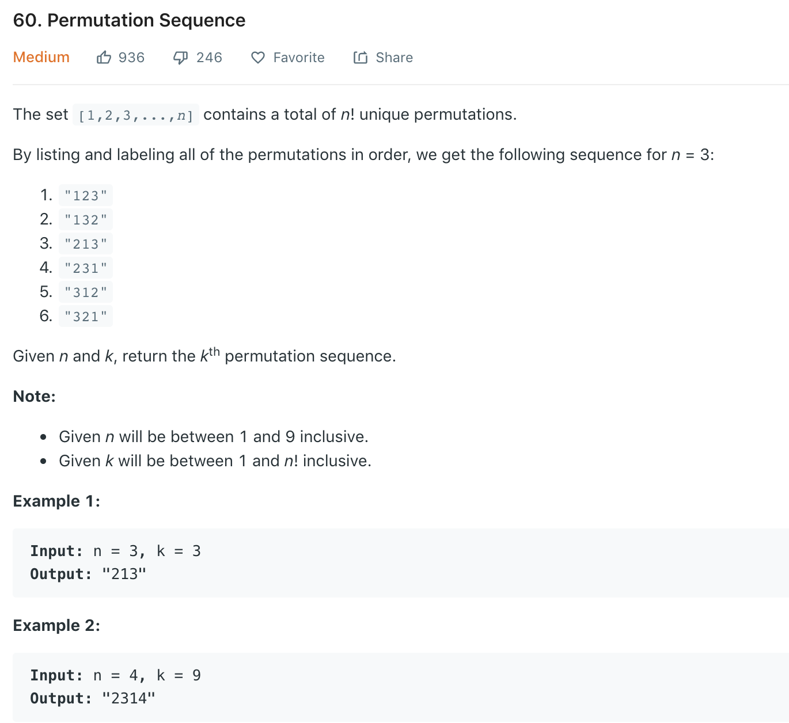

### Solution 1
Brutal Force, TLE
```python
class Solution(object):
    def getPermutation(self, n, k):
        """
        :type n: int
        :type k: int
        :rtype: str
        """
        sequence = []
        self.dfs(n, [], sequence)
        # res = ''
        # for i in sequence[k-1]:
        #     res += str(i)
        return ''.join(list(map(str, sequence[k-1])))
    
    # generate all permutations in ascending order (List[List[Int]])
    def dfs(self, n, path, res):
        if len(path) == n:
            res.append(path)
            return
        
        for i in range(1, n+1):
            if i in path:
                continue
            self.dfs(n, path + [i], res)
```
### Solution 2
```python
class Solution(object):
    def getPermutation(self, n, k):
        numbers = list(range(1, n+1))
        permutation = ''
        k -= 1
        while n > 0:
            n -= 1
            # get the index of current digit
            index, k = divmod(k, math.factorial(n))
            permutation += str(numbers[index])
            # remove handled number
            numbers.remove(numbers[index])

        return permutation
```
