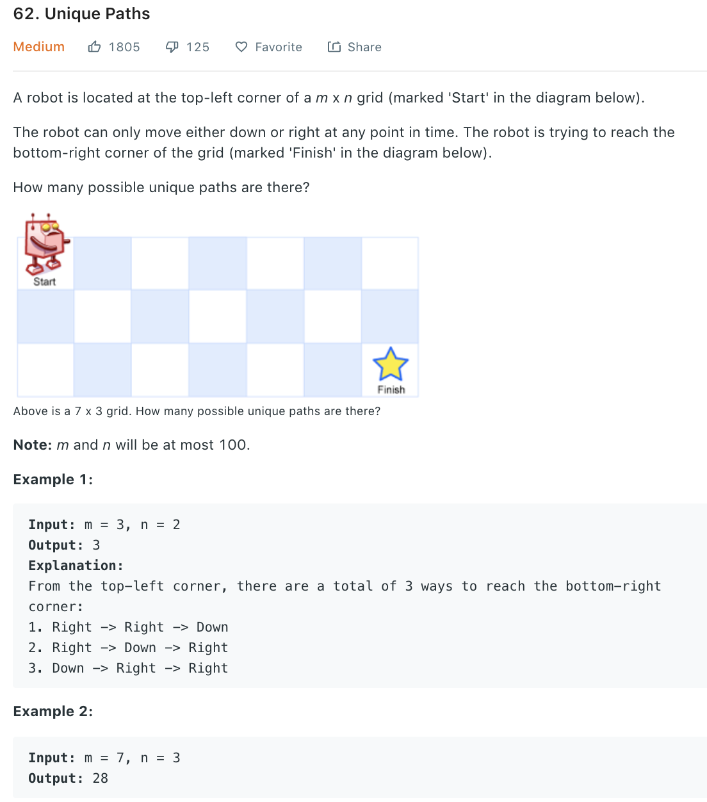

### Solution DP
```dp[i][j]``` represents the number of paths to reach pos(i, j). We have: 
+ dp[i][0] = dp[0][j] = 1, as there is only one way to reach first row or first column
+ dp[i][j] = dp[i-1][j] + dp[i][j-1], as we can only reach pos(i, j) either from the block above or left.
```python
class Solution(object):
    def uniquePaths(self, m, n):
        """
        :type m: int
        :type n: int
        :rtype: int
        """
        dp = [[0] * n for _ in range(m)]

        for i in range(m): dp[i][0] = 1
        for j in range(n): dp[0][j] = 1

        for i in range(1, m):
            for j in range(1, n):
                dp[i][j] = dp[i - 1][j] + dp[i][j - 1]
        
        return dp[-1][-1]
```
Space optimization as we only need one array.
```python
class Solution(object):
    def uniquePaths(self, m, n):
        dp = [1] * n
        for i in range(1, m):
            for j in range(1, n):
                dp[j] = dp[j - 1] + dp[j]
        
        return dp[n - 1]
```
### Solution 2 Formula
To reach the bottom right, we need to go m-1 steps 'down' and n-1 steps 'right'. So we can select m-1(or n-1) 'down'(or right) out of m+n-2 steps.
```C(m+n-2, m-1) = (m+n-2)!/(m-1)!(n-1)! = (m)(m+1)...(m+n-2)/(n-1)!```
```python
class Solution(object):
    def uniquePaths(self, m, n):
        N, k = m + n - 2, m - 1
        # res = 1
        num, denom = 1, 1
        for i in range(1, k + 1):
            # res *= ((N - k + i) / i)
            num *= (N - k + i)
            denom *= i
        # return int(res)
        return num // denom
```
