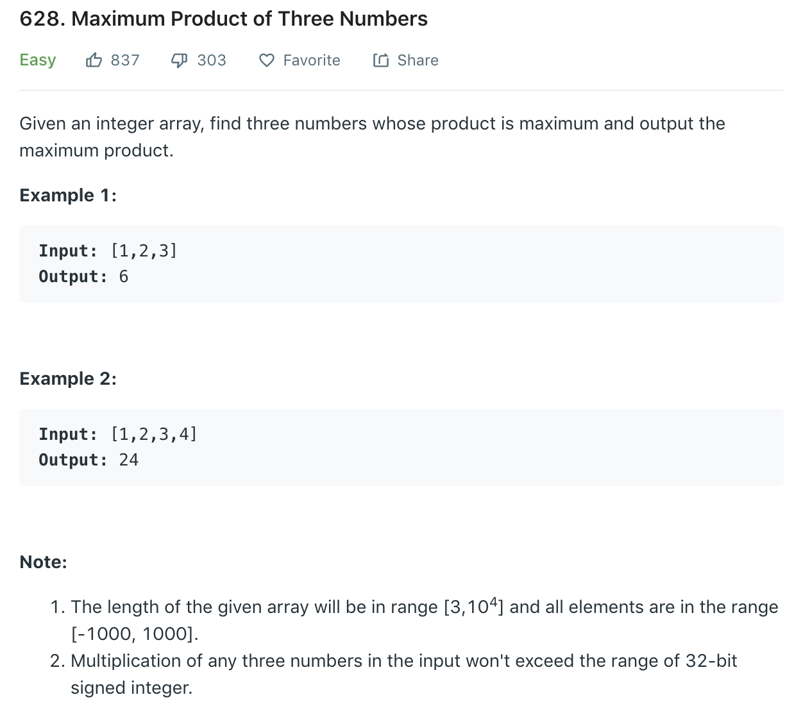

### Solution 1
```python
class Solution(object):
    def maximumProduct(self, nums):
        """
        :type nums: List[int]
        :rtype: int
        """
        #         find top 3 max, top 2 min (if < 0)
        # b1, b2, b3, l1, l2, l3 = nums[0], nums[0], nums[0], nums[0], nums[0], nums[0]
        b1, b2, b3, l1, l2, l3 = -float('inf'), -float('inf'), -float('inf'), float('inf'), float('inf'), float('inf')
        for n in nums:
            if n > b1:
                b1, b2, b3 = n, b1, b2
            elif n > b2:
                b2, b3 = n, b2
            elif n > b3:
                b3 = n

            if n < l3:
                l3, l2, l1 = n, l3, l2
            elif n < l2:
                l2, l1 = n, l2
            elif n < l1:
                l1 = n
                
        if b1 > l2:
            return max(b1 * b2 * b3, l2 * l3 * b1)
        return b1*b2*b3
```

### Solution 2
```python
def maximumProduct(nums):
    nums.sort()
    n1 = nums[-1] * nums[-2] * nums[-3]
    n2 = nums[0] * nums[1] * nums[-1]
    return max(n1, n2)
```