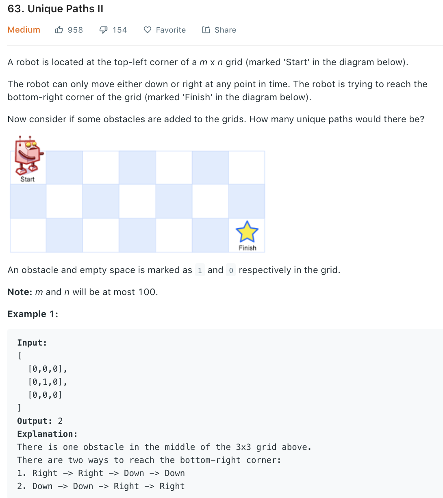

### Solution
```python
class Solution(object):
    def uniquePathsWithObstacles(self, obstacleGrid):
        m, n = len(obstacleGrid), len(obstacleGrid[0])
        dp = [[0]*n for _ in range(m)]

        if obstacleGrid[0][0] == 1: return 0
        dp[0][0] = 1
        # filling first row
        for j in range(1, n):
            if obstacleGrid[0][j] == 0 and dp[0][j-1] != 0:
                dp[0][j] = 1
        # filling first col
        for i in range(1, m):
            if obstacleGrid[i][0] == 0 and dp[i-1][0] != 0:
                dp[i][0] = 1
        #remaining
        for i in range(1, m):
            for j in range(1, n):
                if obstacleGrid[i][j] == 0:
                    dp[i][j] = dp[i - 1][j] + dp[i][j - 1]

        return dp[-1][-1]
```
Space optimization using only one array.
```python
class Solution(object):
    def uniquePathsWithObstacles(self, obstacleGrid):
        """
        :type obstacleGrid: List[List[int]]
        :rtype: int
        """
        if not obstacleGrid or not obstacleGrid[0]:
            return 0
        
        m, n = len(obstacleGrid), len(obstacleGrid[0])
        dp = [0] * (n)
        for j in range(n):
            if obstacleGrid[0][j] == 1:
                dp[j] = 0
                break
            dp[j] = 1
        
        for i in range(1, m):
            #DONOT DO below as we can only set to 0, cannot set back to 1
            # if dp[0] == 1 and obstacleGrid[i][0] != 1:
            #     dp[0] = 1
            if obstacleGrid[i][0] == 1:
                dp[0] = 0
            for j in range(1, n):
                if obstacleGrid[i][j] == 1:
                    dp[j] = 0
                else:
                    dp[j] = dp[j] + dp[j-1]
        
        return dp[-1]
```