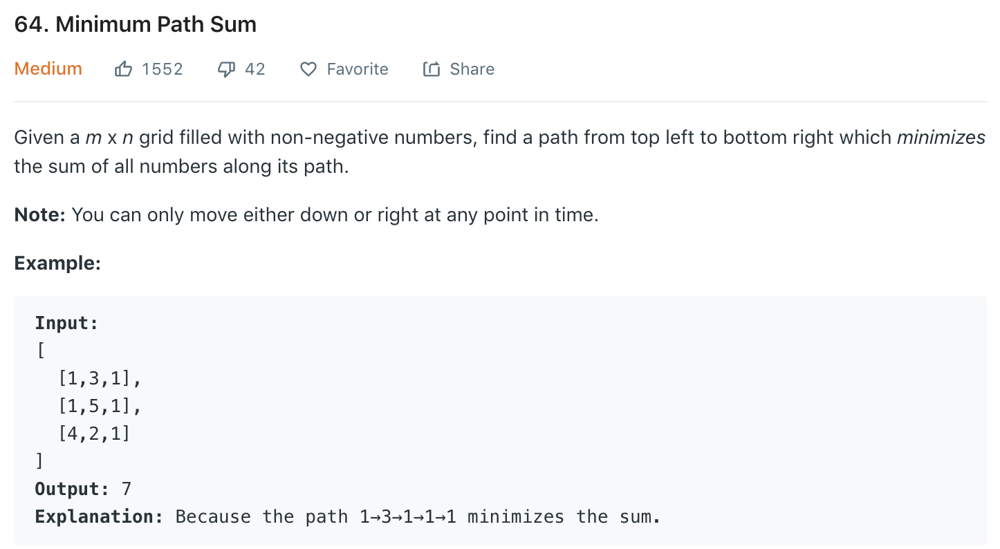

similar to [62](62.md) [63](63.md), use 2d DP. d[m][n] denotes the minimal sum reaching [m][n] for first row and first col:
+ d[0][0] = grid[0][0], d[0][j] = d[0][j-1] + grid[0][j], d[i][0] = d[i-1][0] + grid[i][0]
+ d[i][j] = min (d[i-1][j], d[i][j-1]) + grid[i][j]

### Solution
```python
class Solution(object):
   def minPathSum(self, grid):
        """
        :type grid: List[List[int]]
        :rtype: int
        """
        if not grid or not grid[0]: return 0

        m, n = len(grid), len(grid[0])
        dp = [[0] * n for _ in range(m)]
        dp[0][0] = grid[0][0]
        for j in range(1, n):
            dp[0][j] = dp[0][j - 1] + grid[0][j]
        for i in range(1, m):
            dp[i][0] = dp[i - 1][0] + grid[i][0]
        
        for i in range(1, m):
            for j in range(1, n):
                dp[i][j] = min(dp[i - 1][j], dp[i][j - 1]) + grid[i][j]
        
        return dp[m-1][n-1]
```
Space optimization
```python
class Solution(object):
    def minPathSum(self, grid):
        if not grid or not grid[0]: return 0
        
        row, col = len(grid), len(grid[0])
        dp = [0] * col
        # filling first line
        for j in range(col):
            if j == 0:
                dp[j] = grid[0][j]
            else:
                dp[j] = dp[j - 1] + grid[0][j]
        
        for i in range(1, row):
            dp[0] += grid[i][0]
            for j in range(1, col):
                dp[j] = min(dp[j - 1], dp[j]) + grid[i][j]
        
        return dp[-1]
```
