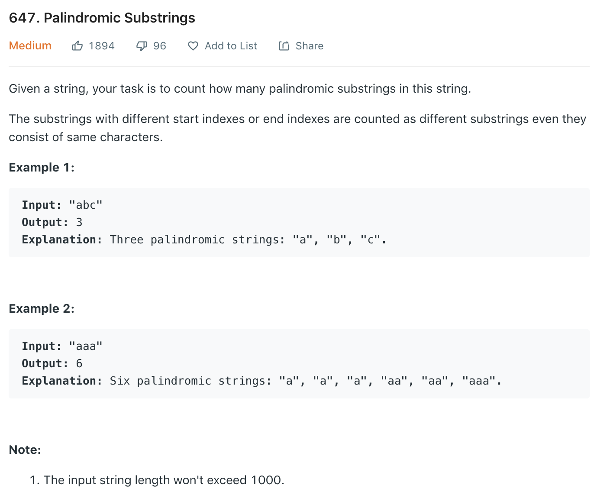

### Solution 
```python
class Solution(object):
    def countSubstrings(self, s):
        """
        :type s: str
        :rtype: int
        """
        if not s: return 0
        self.res = 0
        for i in range(len(s) - 1):
        # for i in range(len(s)):
            self.extend(s, i, i)
            self.extend(s, i, i + 1)
        
        return self.res + 1
        # return self.res
    
    def extend(self, s, i, j):
        while i >= 0 and j < len(s) and s[i] == s[j]:
            self.res += 1
            i -= 1
            j += 1
```

### Solution 2 DP
```python
class Solution:
    def countSubstrings(self, s: str) -> int:
        n = len(s)
        dp = [[False] * n for _ in range(n)]
        cnt = 0
        # dp[i][j]: s[i:j+1] is palindrome
        # dp[i][j] = True if s[i] == s[j] and (j-i<=2 or dp[i+1][j-1])
        for i in reversed(range(n)):
            for j in range(i, n):
                if s[i] == s[j]:
                    if j-i<= 2 or dp[i+1][j-1]:
                        dp[i][j] = True 
                        cnt += 1
        return cnt
```