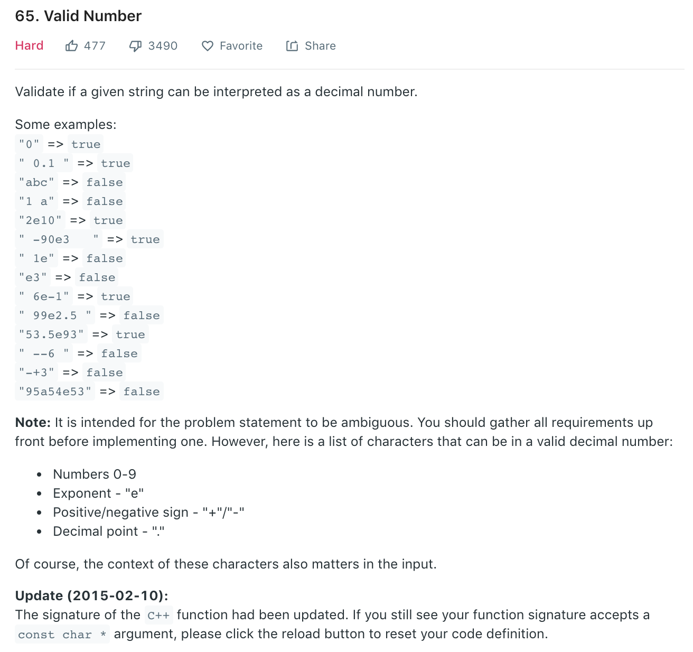

Similar to [8](8.md). Some test cases:
```
test(1, "123", true);
test(2, " 123 ", true);
test(3, "0", true);
test(4, "0123", true);  //Cannot agree
test(5, "00", true);  //Cannot agree
test(6, "-10", true);
test(7, "-0", true);
test(8, "123.5", true);
test(9, "123.000000", true);
test(10, "-500.777", true);
test(11, "0.0000001", true);
test(12, "0.00000", true);
test(13, "0.", true);  //Cannot be more disagree!!!
test(14, "00.5", true);  //Strongly cannot agree
test(15, "123e1", true);
test(16, "1.23e10", true);
test(17, "0.5e-10", true);
test(18, "1.0e4.5", false);
test(19, "0.5e04", true);
test(20, "12 3", false);
test(21, "1a3", false);
test(22, "", false);
test(23, "     ", false);
test(24, null, false);
test(25, ".1", true); //Ok, if you say so
test(26, ".", false);
test(27, "2e0", true);  //Really?!
test(28, "+.8", true);  
test(29, " 005047e+6", true);  //Damn = =|||
Copy

```
### Solution
```python
class Solution(object):
    def isNumber(self, s):
        """
        :type s: str
        :rtype: bool
        """
        s = s.strip()
        eSeen, pointSeen, numSeen, hasNumAfterE = False, False, False, True
        for i, c in enumerate(s):
            if '0' <= c and c <= '9':
                numSeen = True
                hasNumAfterE = True
            elif c == '.':
                if eSeen or pointSeen: return False
                pointSeen = True
            elif c == 'e':
                if eSeen or not numSeen: return False
                eSeen = True
                hasNumAfterE = False
            elif c == '-' or c == '+':
                if i != 0 and s[i - 1] != 'e': return False
            else:
                return False

        return numSeen and hasNumAfterE
```