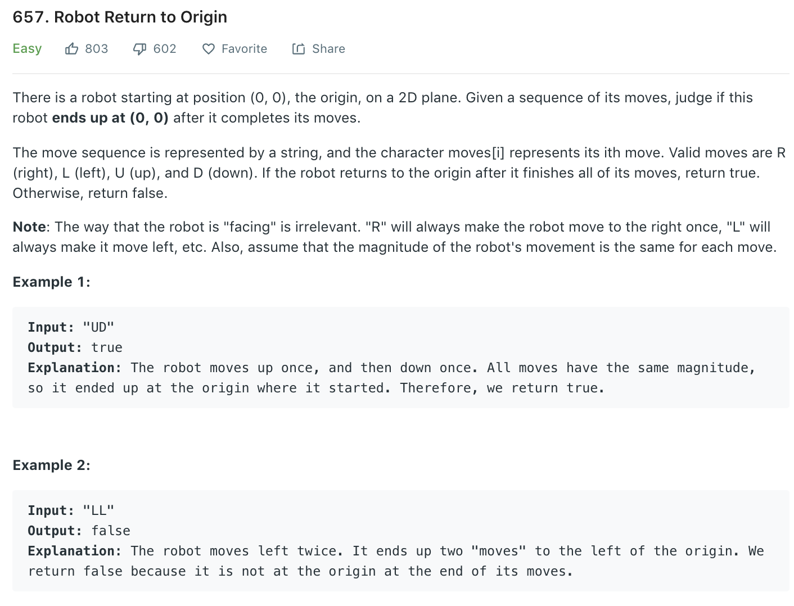

### Solution
```python
class Solution(object):
    def judgeCircle(self, moves):
        """
        :type moves: str
        :rtype: bool
        """
        up_down = 0
        left_right = 0
        # mapping = {'U': 1, 'D': -1, 'L': 1, 'R': 1}
        
        for move in moves:
            if move == 'U':
                up_down += 1
            elif move == 'D':
                up_down -= 1
            elif move == 'L':
                left_right += 1
            else:
                left_right -= 1
        
        return up_down == 0 and left_right == 0    
```
or 
```python
def judgeCircle(moves):
    c = dict(collections.Counter(moves))
    return c.get('U', 0) == c.get('D', 0) and c.get('L', 0) == c.get('R', 0)
```