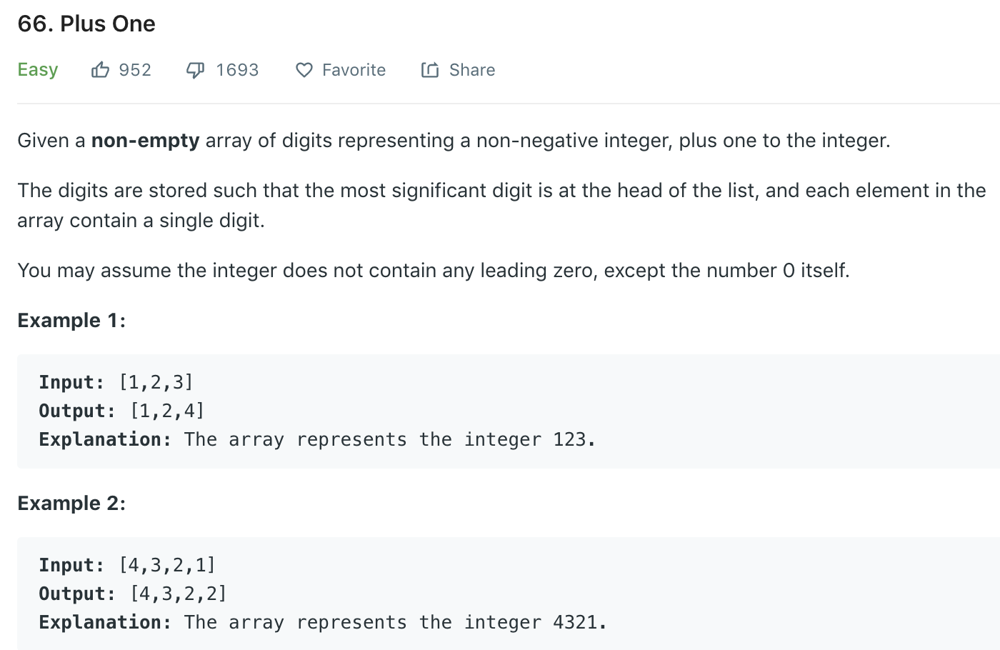

### Solution
```python
class Solution(object):
    def plusOne(self, digits):
        """
        :type digits: List[int]
        :rtype: List[int]
        """
        res = []
        i = len(digits) - 1
        carry = 1
        
        while i >= 0 or carry:
            digit = carry
            if i >= 0:
                digit += digits[i]
                i -= 1

            res.append(digit % 10)
            carry = digit // 10
        
        return res[::-1]
```
A faster _in-place_ solution based on we only add 1.
```python
def plusOne(digits):
    for i in reversed(range(len(digits))):
        if digits[i] < 9:
            # cannot have carry anymore
            digits[i] += 1
            break
        else:
            digits[i] = 0

    # handling 0 at the highest digit
    if digits[0] == 0:
        digits.insert(0, 1)

    return digits
```